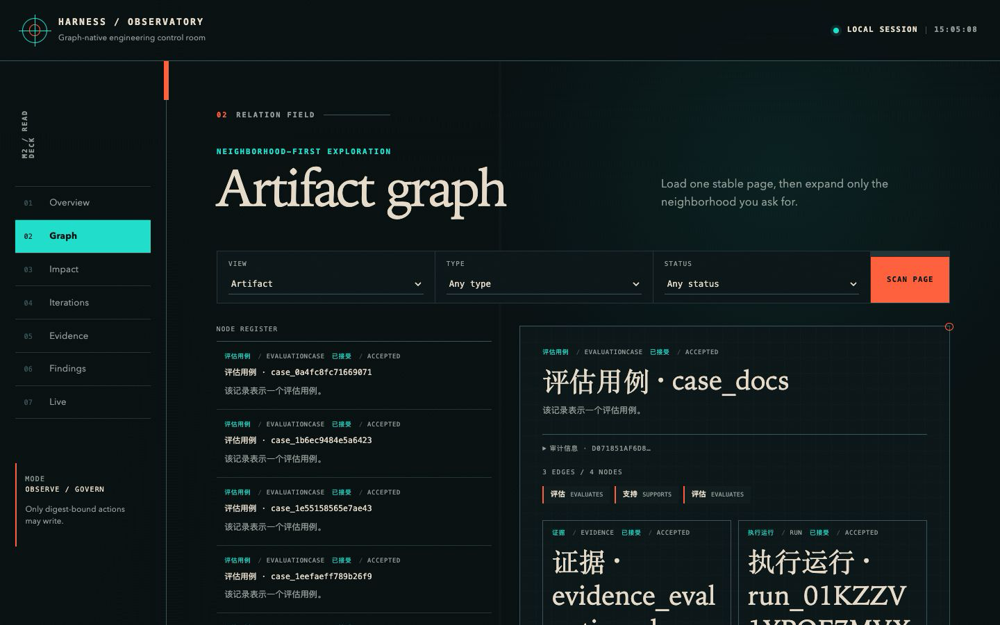
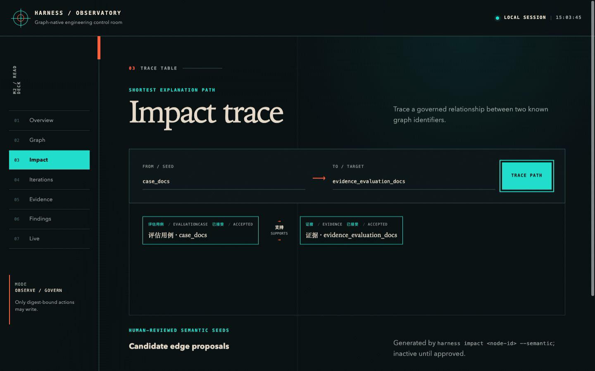
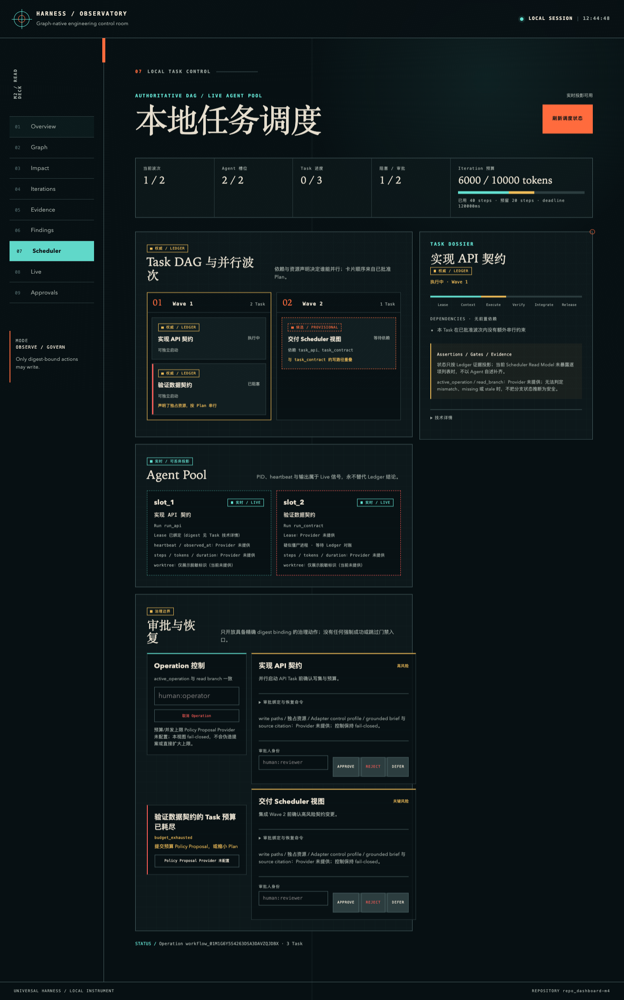
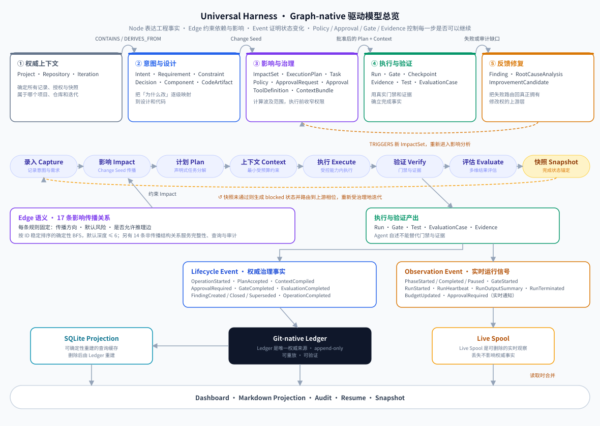
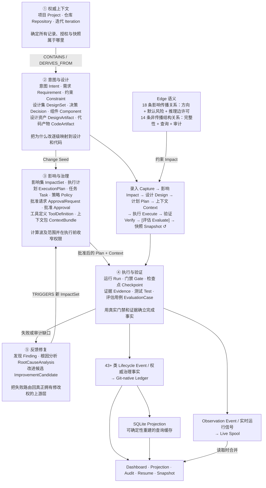
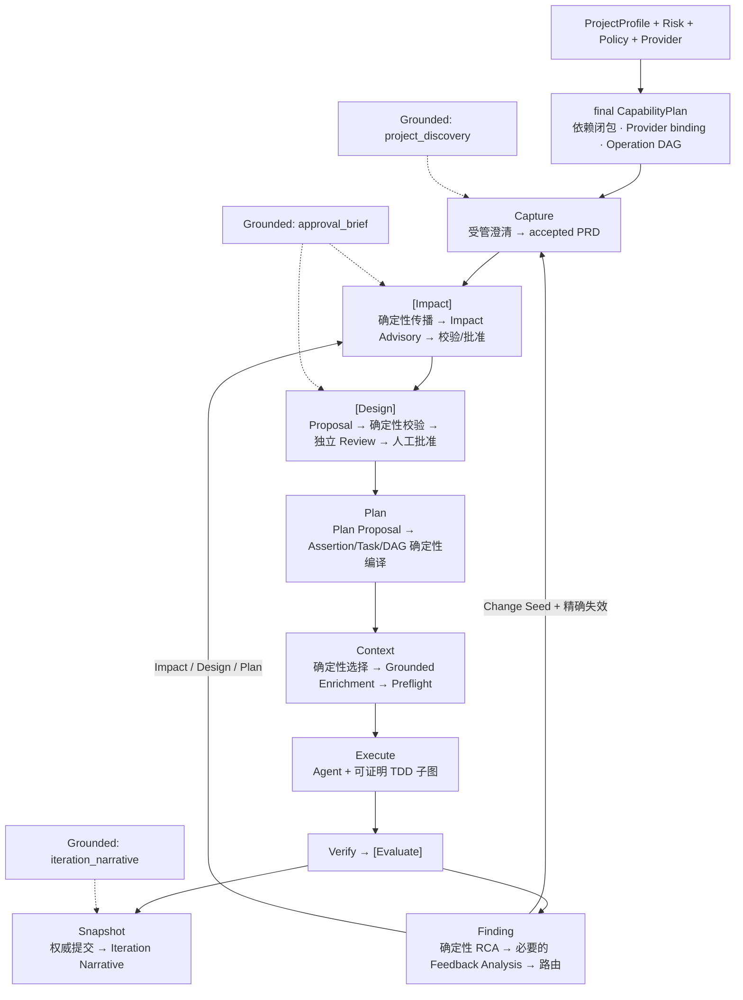

# Universal Harness

[](https://github.com/maochendong/universal-harness/actions/workflows/ci.yml)

Universal Harness 是一个 Graph-native、Provider-neutral 的工程 Harness，用于驱动可审计的软件迭代。

一个编排命令可以完成完整纵向闭环：

```text
新建或接管项目 → 选择并确认 Lite / Standard / Governed
→ 受管澄清并接受高质量 PRD
→ 同步 Artifact Graph 与 CapabilityPlan
→ [Impact] 确定性影响传播 + 模型增补建议
→ [Design] 形成、独立评审并批准 DesignSet
→ 提议任务分解并确定性编译 ExecutionPlan
→ 选择最小 Context 并生成带来源的解释增强
→ 直接执行、通过受控 Agent Loop 执行或人工执行
→ [Strict TDD] 证明 Baseline → Red → Green → Refactor
→ 执行质量门禁、[独立评估] 与证据裁决
→ 确定性 RCA + 必要的语义分析 → 定向回流
→ 提交 Iteration Snapshot 并生成带引用的迭代叙事
```

方括号中的节点只在 final CapabilityPlan 启用对应 Module 时物化；未启用时不存在空壳 Port、工件、Event 或 Approval。

本设计采用一套 Git-native Ledger，并提供 Artifact Graph 与 Execution Graph 两个逻辑视图。Agent 提出语义工作建议；Harness 控制计划、上下文、能力、预算、终止、证据、恢复和权威更新。

M1、M2 与 Protocol 1.1 的 19-task 能力已经形成统一产品面。除 M1/M2 的执行治理、Finding、Dashboard 与实时事件流外，Harness 还具备三档 Profile、动态 Capability DAG、受管 PRD Capture、DesignSet、可证明 TDD、四个领域模型 Port 与四用途 Grounded Synthesis。请从 [快速开始](docs/getting-started.md) 运行第一次闭环，并在 [完整 Graph-native 模型](docs/graph-driven-harness-model.md) 中理解各能力怎样共同驱动迭代。

当前受版本控制的实现已通过 2182 项全量测试以及 security、fault、performance、E2E、Dashboard 和 pack smoke；打包 CLI 的 Lite / Standard / Governed 三档闭环均到达 completed Snapshot，Governed 留下 `Baseline → Red → Green` 的成对账本证据。发布状态仍以自动报告为准：M1 为 27/28，只有同 commit 的 Ubuntu/macOS/Windows 证据 AC25 尚未验证；M2 为 13/13。详见 [全量评审修复完成证据](docs/evidence/full-review-remediation-completion.md)，不要把本地通过误读为跨平台发布完成。

## Dashboard 效果


_基于 atlas-mvp 真实 Harness 数据的本地 Observatory Dashboard。_



_Graph 视图展开评估用例 `case_docs`，展示它与 Evidence、Run、Task 的真实关系邻域。_



_Impact 视图展示 `case_docs` 到 `evidence_evaluation_docs` 的受治理最短解释路径。_



_Scheduler 视图把批准 Plan 的 wave、隔离 Agent slot、Task 权威状态、预算预留、阻塞 Finding 与按 Policy 产生的 Approval 放在同一读模型中；图中为可重复的 Playwright fixture，不代表真实 provider 并发验收已经通过。_

## Graph-native 驱动模型

<!-- graph-model:readme-overview:start -->

Harness 不是让 Agent 在代码仓库中自由循环，而是用类型化 Node 表达工程事实、用 Edge 约束依赖与影响、用 Event 证明状态变化，再由 Policy、Approval、Gate 和 Evidence 控制每一步是否可以继续。



<details>
<summary>Mermaid 源码（文字降级，与 SVG 等价）</summary>



</details>

### 图中五个职责域

| 职责域         | 它是什么                                                                                                                                                               | 怎样驱动下一步                                                             |
| -------------- | ---------------------------------------------------------------------------------------------------------------------------------------------------------------------- | -------------------------------------------------------------------------- |
| **权威上下文** | `Project`、`Repository`、`Iteration` 确定当前工作属于哪个项目、仓库和迭代，是记录、授权、恢复与快照的归属根。                                                          | 为后续 Node、Event 和 Ledger transaction 提供稳定身份与基线。              |
| **意图与设计** | `Intent`、`Requirement`、`Constraint`、`DesignSet`、`Decision`、`Component`、`DesignArtifact`、`CodeArtifact` 把自然语言目标变成可追踪、可审批的需求、设计和实现对象。 | 任一权威对象变化都会成为 Change Seed，由关系规则计算影响范围。             |
| **影响与治理** | `ImpactSet` 固化解释路径和风险；`ExecutionPlan` / `Task` 描述工作；Policy、Approval、ToolDefinition、ContextBundle 在执行前收窄能力。                                  | 只有已批准、覆盖完整且 digest 未漂移的计划与上下文才能进入执行。           |
| **执行与验证** | `Run` 保存 Provider 的真实 outcome；Gate、Test、EvaluationCase 和 Evidence 共同决定 Task 与 Iteration 是否真的完成；Checkpoint 提供幂等恢复。                          | 通过则进入审计和 Snapshot；失败则产生 Finding，不能用 Agent 自述绕过门禁。 |
| **反馈修复**   | `Finding` 把失败或审计缺口结构化，`RootCauseAnalysis` 确定根因和归属层，`ImprovementCandidate` 提出可评审修改。                                                        | 改进通过 `TRIGGERS` 产生新 ImpactSet，回到 Impact 重新分析、批准和计划。   |

### 影响传播为什么只走 18 类关系

18 条影响传播关系为每种可穿越 Edge 固定 **传播方向、默认风险、是否允许推理边**。除原有 17 条外，`SPECIFIES` 以 `both / high / 不允许推理边` 连接 DesignArtifact 与 Requirement、Decision、Component 或 Test。Impact Engine 从 Change Seed 开始执行按 ID 稳定排序的 BFS，只保留确定性最短解释路径；默认最大深度为 6，硬上限为 10。路径经过 high-risk 关系会提升风险；经过 proposed 或低置信度推理边只能进入 `inspect`，等待人审。

另有 14 条非传播结构关系用于表达生成、执行、证据、包含、批准和恢复事实。它们仍参与端点完整性、Graph 查询、Dashboard 邻域和审计，但不会被 Impact BFS 自动穿越，避免 Run 历史、容器或批准记录造成无界影响扩散。

### Event 和完成真相为什么必须分流

- **Lifecycle Event** 记录已经提交的治理事实，随 append-only Git-native Ledger 保存，可重放、可验证，并用于 Resume、Audit、Projection 和 Snapshot。
- **Observation Event** 记录当前相位、Gate、Run heartbeat、输出摘要、预算与等待批准状态，进入 Live Spool，只服务实时体验。
- Ledger 是唯一权威来源；Live Spool 是可删除的实时观察；SQLite 是可确定性重建的查询缓存。读取层可以合并三者展示，但不能把实时通知或缓存状态升级为完成事实。

完整的 28 类 Node、32 类 Edge、43+ 类 Lifecycle Event、11 类 Observation Event、18 条传播规则参数、合法端点说明和端到端示例，见 [完整 Graph-native 模型与传播规则](docs/graph-driven-harness-model.md)。

<!-- graph-model:readme-overview:end -->

## Profile-aware Capability DAG 与模型 Adapter

Harness 不再要求所有项目运行同一条固定重流水线。`ProjectProfile + Risk + Policy + Provider` 被确定性编译为 final `CapabilityPlan`；Workflow Engine 只物化实际启用的节点。Lite 默认保持 Kernel-only，Standard/Governed 启用更深的 Impact、Design、Evaluation、Strict TDD、Audit 与模型 Provider 约束。



五个模型 Port 都是受管的候选/评审/提炼插槽，不是第二套权威系统：

| Port                    | 适用位置                               | 模型可以做什么                                           | Harness 始终保留什么权力                                                     |
| ----------------------- | -------------------------------------- | -------------------------------------------------------- | ---------------------------------------------------------------------------- |
| `ImpactAdvisoryPort`    | Impact 确定性传播后                    | 增补遗漏对象、边候选、风险信号和问题                     | 不允许删除确定性结果、降低风险、改传播方向或激活禁止推理边                   |
| `DesignReviewPort`      | Design Proposal 确定性校验后           | 返回通过建议、修订要求或阻塞及结构化 Finding             | Critical Finding 阻止 ApprovalRequest；最终仍由人工批准 DesignSet            |
| `PlanProposalPort`      | Plan 编译前                            | 建议 Task、Assertion Cluster、DAG、并行与 Context budget | Harness 编译 canonical Assertion、Task id/digest、路径、Gate 与 TDD Contract |
| `FeedbackAnalysisPort`  | 确定性 RCA 无法分类或信号冲突时        | 提出带来源和置信度的诊断、Change Seed 与验证建议         | 不覆盖确定性 RCA，不决定目标层、失效范围或 privileged route                  |
| `GroundedSynthesisPort` | Discovery、Context、Approval、Snapshot | 按四种固定 purpose 生成逐 claim 引用来源的中文业务提炼   | 不改变 Graph、CapabilityPlan、审批对象、Context 权限、Snapshot 或 Verdict    |

四种 Grounded purpose 固定为 adopt 扫描后的 `project_discovery`、Context 选择后的 `context_enrichment`、真实审批前的 `approval_brief`、Snapshot 提交后的 `iteration_narrative`，各自拥有独立 prompt、Schema、budget、conversation、run identity 和 Evidence。Standard/Governed 对适用槽位强制配置 Provider；缺失或必需调用失败会阻塞，唯一例外是 `iteration_narrative`——Snapshot 先完成，叙事失败只生成可恢复的 Projection Finding。

## 核心设计思路

- **Git 是唯一权威存储**：所有权威状态以原子事务写入 Git-native Ledger（append-only、可安全合并的分片）；SQLite 只是可随时删除并确定性重建的查询缓存。
- **确定性优先**：repository-qualified Locator、基于 UUIDv5 的扫描节点 ID、canonical JSON + SHA-256 摘要，保证同一逻辑输入在 Linux、macOS、Windows 上产生相同的 ID 与 digest，重放幂等。
- **Agent / 模型提议，Harness 决策**：Agent 与模型只能返回类型化 Proposal、Review 或带引用的 Synthesis，永远不能自我批准、自我接受证据或直接写权威状态；确定性校验、风险上界、计划、上下文、能力、预算、终止、恢复和原子提交全部由 Harness 强制执行。
- **受限执行**：声明式 ExecutionPlan（拒绝嵌入命令与能力扩张）、按任务编译的 ContextBundle（预算、Freshness、敏感内容本地化）、Policy 字段级 merge operator 合并（冲突即 Block）、只收窄不扩张的 Capability Grant。
- **可审计、可恢复**：Approval 绑定精确 digest，漂移即失效；外部副作用以 Intent Journal 记录，结果不确定时对账而非盲目重试；Checkpoint + Resume 保证中断后不产生重复记录或副作用。
- **Provider-neutral 插件面**：VCS、Agent、Pack、Tool、Gate、Projection 均为版本化端口，第三方插件经 Capability Manifest 声明能力，并由 Conformance Kit 验证契约。

## M4 本地 Multi-Agent 调度

Standard/Governed 在 final CapabilityPlan 启用 `parallel_task_execution` 时，Plan 的 Task 依赖、声明写路径和独占资源会被确定性编译为 waves。Scheduler 对每个 Task 分配独立 Lease、Run、Context、预算预留、worktree 和新建 Agent 会话；候选先过 Task/candidate Gate，再按 Plan 顺序验证，整 wave 通过 Gate 后才以 CAS 集成并提交 `WaveIntegration`。Lite 与 Protocol 1.2 仍走顺序执行，不生成 M4 记录。

```text
Plan DAG → deterministic waves → Lease + AgentPool + isolated worktree
→ Task Gate → candidate Gate → wave Gate → CAS → WaveIntegration
→ Verify → [Evaluate] → Snapshot
```

完成真相仍来自 Git-native Ledger。Agent 返回只是一份 provisional 候选；SQLite 只保存可删除的 live projection，丢失后从 Ledger 重建。单机 Driver Lock 防止 CLI 与 Dashboard 同时驱动同一 Operation；启用 M3 时它嵌套在 Operation Lease 内，不扩展为后台 Scheduler 服务。

当前本地调度内核、CLI、Dashboard、真实 Git 四 Task/三 wave 确定性 E2E、故障/安全/性能门禁已经落地。M4 尚未声明完成：真实 dsh Adapter 的公开能力为 `delegated + external-only`，因此 Harness 正确降级到受监督单槽位，AC-06 与 AC-20 缺少真实 provider 双槽重叠和完整四 Task dogfood；Dashboard 的生产 Policy Proposal、完整 grounded approval context，以及 driver 存活时批准自动唤醒/operation 级取消闭环也仍在 AC-16/17 中阻塞。状态以 [M4 完成证据](docs/evidence/m4-local-multi-agent-scheduling-completion.md) 为准。

## 已支持的能力

- **三档 Profile 与动态 DAG**：安装或接管时由用户确认 Lite、Standard、Governed；Capability Compiler 根据风险、Policy、Provider 和依赖闭包生成 final CapabilityPlan。未启用 Module 零 Port、零工件、零 Event、零 Approval，Dashboard 稳定显示 `inactive_by_profile`。
- **受管高质量 PRD Capture**：CLI/Dashboard 共用可恢复澄清状态机；结构化 PrdProposal 是唯一内容权威，经过确定性硬门禁、独立 Review、风险自适应批准和不可变 accepted PRD 提交。每个原子 Criterion 稳定派生 Test seed 与 canonical Assertion。
- **DesignSet 生命周期**：Impact 与 Plan 之间正式保留 Design；Decision、Component、API/Data/UI 契约与 test_strategy 形成原子 DesignSet，经独立 DesignReview 和人工批准后才进入 Graph。Plan 必须同时消费 accepted PRD、frozen ImpactSet、accepted DesignSet 与 final CapabilityPlan。
- **可证明 TDD**：适用 Task 执行 Baseline → Test Patch → Red → Green → Refactor，Red 前不能获得 production Grant；TaskVerdict 强制消费成对 Evidence、Gate、Evaluation 与未漂移 Contract，账本可以证明先红再绿。
- **受管模型建议与 Grounded Synthesis**：Impact Advisory、Design Review、Plan Proposal、Feedback Analysis 和四用途 Grounded Synthesis 共用隔离的 Invocation Runner，但各自使用独立领域 Schema、预算、会话和 Evidence；模型结果永远先经确定性 Validator。
- **严格执行治理**：Agent 任务在 RunStarted 前必须完成 Impact coverage、原子验收、Task-local ContextBundle、完整 CapabilityGrant 与 ExecutionAuthorization 校验；Plan、Context、Policy、批准或 Adapter Profile 任一 digest 漂移都会回到对应上游相位，executor 调用保持为零。
- **分层完成真相**：Run 保留 Provider 的原始 `handoff`/`partial`/`failed` 事实，Task 是否通过只由逐断言 TaskVerdict 决定，Iteration 是否完成只由 Gate、Evaluation、审计和 Snapshot 决定。CLI 分别输出 `source_commit`、`ledger_commit`、`repository_head`。
- **旧开放迭代严格迁移**：历史已完成数据继续只读并标记 `legacy_inferred`；缺少新治理绑定的旧开放迭代返回 `migration_required`，追加诊断并从 impact/plan 重建，不改写旧 artifact，也不复用旧批准。
- **完整迭代闭环**：默认帮助只展示 `new`、`adopt`、`iterate`、`resume`、`status`、`serve` 六个业务主入口；`approve`、`finding`、`impact`、`design`、`plan`、`run`、`verify`、`eval`、`snapshot`、`audit`、`doctor`、`graph` 等高级诊断/恢复能力按需展开，旧命令保留一个 major 的兼容别名。CLI 与 Dashboard 可交替推进同一 Capture/Approval 会话，交互与非交互（`--json`）均使用稳定退出码。
- **统一实时可观测性**：相位、Gate、Run heartbeat/output、预算、终止和批准事件写入可删除的 live spool，并与权威 Ledger 生命周期事件合并；底层 heartbeat 每 5 秒记录，当前命令每 30 秒最多显示一次聚合摘要，状态变化立即显示；`harness status` 在运行中投影 `active_run`，`--json` 的 stdout 始终只保留最终 CommandResult。
- **本地 Dashboard**：`harness serve [--port <port>]` 只监听 loopback，按 CapabilityPlan 渐进展示 Overview、Graph、Impact、Design、Plan、Iterations、TDD/Evidence、Findings、Live 和 Approvals。Approval 卡默认展示带来源的中文 brief，同时保留确定性对象、风险、范围和 digest；模型页展示 slot/purpose、Provider、tokens/steps/duration/cost、引用、阻塞与恢复。随机一次性 URL token 交换为 HttpOnly session，写操作要求同源 Origin、session CSRF、actor 与 expected digest。
- **Finding 治理**：按 rule、scope、severity、actionability 稳定分组，显示计数、样本与 membership digest；`harness finding group <accept|close|supersede> <group-id> --digest <digest>` 全成全败地批量处置，stale-knowledge 在知识源刷新后自动衰减但保留历史。
- **确定性语义建议**：`harness impact [node-id] --semantic` 使用本地 symbol/import/path/term 索引提出 top-K `MAY_IMPACT` 边；建议与索引、输入和 revision digest 绑定，未经 `harness graph approve-edge` 人审不会进入活动图，Provider 失败会退回结构影响分析。
- **可选 LLM Judge**：runtime config v2 可声明 OpenAI-compatible Judge Gate；默认不配置、零网络调用且默认 advisory。只有显式请求、accepted Policy 启用 blocking、且该 Policy revision 获得有效 Approval 三项同时成立时才可阻断。Review Bundle、请求/响应 digest、重试和错误类型进入脱敏 Evidence。
- **多任务计划与进度**：ExecutionPlan 可将一次迭代分解为多个带依赖的小任务（整个计划一次批准），逐任务执行与评估，崩溃恢复只重跑未完成任务；`harness status` 报告 `2/3` 式任务进度。
- **Stack Pack**：Generic、Node、Python、Java——栈检测、扫描、Stack 层 Gate 声明与 Pack 升级预览/批准。
- **Agent Adapter**：Manual Adapter（人工交接）与通用 Command Adapter（包装现有 Coding Agent CLI），按 Control Profile 决定能否无人值守；无法计量或拦截的 Provider 只能监督运行。
- **真实执行与项目门禁**：受管项目可通过提交 `.harness/runtime.json` 选择经版本探针校验的 dsh headless、声明任务读写边界，并把仓库内测试脚本注册为强制 Gate；执行 transcript、前后仓库摘要和门禁日志摘要统一回到账本 Evidence 链。
- **质量反馈**：universal / stack / project 三层 Gate、绑定漂移即失效的 Evidence Freshness、Run 五维评估（outcome / safety / trajectory / efficiency / correct failure）、Finding → 确定性 RCA → 必要的 FeedbackAnalysis → 归属上游 Phase 的修复路由；每次评估都会落地 `Run → Evidence → EvaluationCase → Run/Task` 图链。模型不能覆盖确定性 RCA，低置信度或高风险 Change Seed 必须人工复核，门禁不过不出完成快照。
- **主动审计**：快照相位自动重跑确定性图审计（可追溯性、freshness、图健康、设计/决策文档覆盖度、Task↔Requirement 挂接、合同条目覆盖、任务证据时效），缺口按内容派生 id 幂等落账为 Finding 并进入人审核级联；`harness status` 以 blockers / warnings 分级呈现；迭代自动增量重扫工作区文档入图。
- **知识投影**：PRD 从 AcceptedPrdRecord 重建，Architecture/Specification 从 accepted DesignSet、Decision、Component、DesignArtifact 和关系边重建，Plan 显示 DesignSet/Assertion/Task 绑定，Snapshot 显示 TDD proof 与带来源的 iteration narrative；所有 Markdown 投影受管写入、漂移自动重生成，不反向成为权威源。
- **发布工程**：Ubuntu / macOS / Windows 三平台 CI matrix 与同 commit 工件聚合；security / fault / property / performance 发布门禁；28 条验收标准自动追溯；自包含 npm 包（离线可安装）。缺少任一平台工件时 AC25 保持 `not_verified` 并阻止发布，不能用 workflow 文件存在或本地结果代替。
- **远程协作（M3，可选模式，开发中——三平台真实 dogfood 证据未齐，尚未发布）**：从批准的 Git Remote 自动识别 GitHub / GitLab / Gitee 主体身份，无人工平台绑定；受保护的 Control Ref 承载追加式 Control 链（Principal Snapshot、Operation Lease、fencing token、远程 Approval Decision），Token 不进入任何持久化记录或日志；两个 Replica 可并行推进不同 Operation，Integration 只在候选侧确定性重排 Ledger sequence，Target 以 CAS 提交；CLI 与 Dashboard 对连接、Approval 收件箱与 Conflict 呈现一致视图。未启用时零远程副作用。

## 文档

- [完整 Graph-native 模型与传播规则](docs/graph-driven-harness-model.md)
- [快速开始](docs/getting-started.md)
- [接管已有项目](docs/adopting-a-project.md)
- [运维与恢复](docs/operations-and-recovery.md)
- [M2 运维指南](docs/operations.md)
- [插件契约](docs/plugin-contracts.md)
- [dsh headless 本机契约](docs/dsh-headless-contract.md)
- [M1 验收报告](docs/m1-acceptance-report.md)
- [M2 验收报告](docs/m2-acceptance-report.md)
- [M3 远程协作完成证据](docs/evidence/m3-remote-collaboration-completion.md)
- [全量评审修复完成证据](docs/evidence/full-review-remediation-completion.md)

## 设计文档

- [已批准的 M1 设计](docs/superpowers/specs/2026-08-11-universal-harness-m1-design.md)
- [已批准的 M1 实施计划](docs/superpowers/plans/2026-08-11-universal-harness-m1-implementation-plan.md)
- [M2–M3 范围决策](docs/superpowers/specs/2026-08-15-m2-m3-scope-decisions.md)
- [已完成的 M2 设计](docs/superpowers/specs/2026-08-16-universal-harness-m2-design.md)
- [已完成的 M2 实施计划](docs/superpowers/plans/2026-08-16-universal-harness-m2-implementation-plan.md)
- [M3 远程协作设计](docs/superpowers/specs/2026-08-29-universal-harness-m3-remote-collaboration-design.md)
- [M3 远程协作实施计划](docs/superpowers/plans/2026-08-29-universal-harness-m3-remote-collaboration-implementation-plan.md)
- [SpecKit 对照设计与任务卡](docs/speckit-comparative-design.md)
- [dsh 执行后端对照设计与任务卡](docs/dsh-execution-backend.md)
- [Slim Profiles 与 Capability Kernel](docs/superpowers/specs/2026-08-18-harness-slim-profiles-design.md)
- [Intent → 高质量 PRD Capture](docs/superpowers/specs/2026-08-18-intent-to-prd-capture-design.md)
- [DesignSet 生命周期](docs/superpowers/specs/2026-08-18-designset-lifecycle-design.md)
- [可证明 TDD 协议](docs/superpowers/specs/2026-08-18-provable-tdd-protocol-design.md)
- [模型建议 Adapter 与 Grounded Synthesis](docs/superpowers/specs/2026-08-19-model-advisory-adapters-design.md)
- [Protocol 1.1 统一 19-task 实施计划](docs/superpowers/plans/2026-08-18-protocol-1.1-unified-implementation-plan.md)

## 许可证

采用 Apache-2.0 许可证，详见 [LICENSE](LICENSE)。
