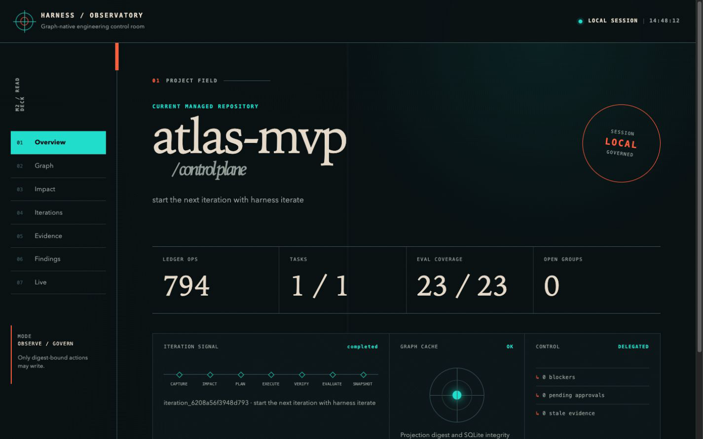
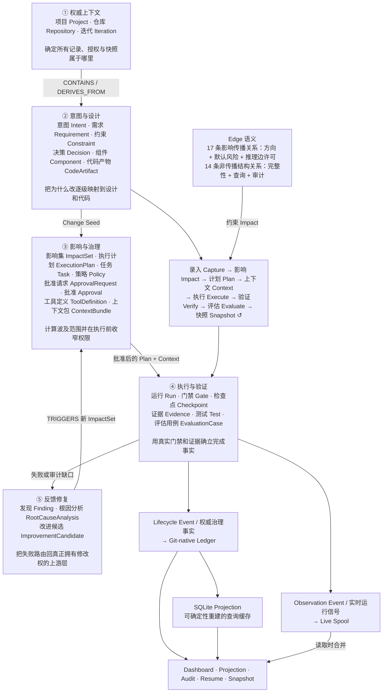

# Universal Harness

[](https://github.com/maochendong/universal-harness/actions/workflows/ci.yml)

Universal Harness 是一个 Graph-native、Provider-neutral 的工程 Harness，用于驱动可审计的软件迭代。

一个编排命令可以完成完整纵向闭环：

```text
新建或接管项目
→ 录入需求
→ 同步 Artifact Graph
→ 执行影响分析
→ 创建声明式 ExecutionPlan
→ 编译受限 Context
→ 直接执行、通过受控 Agent Loop 执行或人工执行
→ 执行质量门禁并评估 Run
→ 必要时完成 RCA 与定向修复
→ 记录 ImprovementCandidate 和 Iteration Snapshot
```

本设计采用一套 Git-native Ledger，并提供 Artifact Graph 与 Execution Graph 两个逻辑视图。Agent 提出语义工作建议；Harness 控制计划、上下文、能力、预算、终止、证据、恢复和权威更新。

M1 与 M2 均已完成。M1 的 Task 1–28 和 28 条验收标准已有通过证据；M2 又交付了 Finding 治理、可选 LLM Judge、确定性语义建议、本地 Dashboard 与统一实时事件流。请从 [快速开始](docs/getting-started.md) 运行第一次闭环，并在 [M2 运维指南](docs/operations.md) 中查看新增能力。

## Dashboard 效果



_基于 atlas-mvp 真实 Harness 数据的本地 Observatory Dashboard。_

## Graph-native 驱动模型

<!-- graph-model:readme-overview:start -->

Harness 不是让 Agent 在代码仓库中自由循环，而是用类型化 Node 表达工程事实、用 Edge 约束依赖与影响、用 Event 证明状态变化，再由 Policy、Approval、Gate 和 Evidence 控制每一步是否可以继续。



### 图中五个职责域

| 职责域         | 它是什么                                                                                                                                      | 怎样驱动下一步                                                             |
| -------------- | --------------------------------------------------------------------------------------------------------------------------------------------- | -------------------------------------------------------------------------- |
| **权威上下文** | `Project`、`Repository`、`Iteration` 确定当前工作属于哪个项目、仓库和迭代，是记录、授权、恢复与快照的归属根。                                 | 为后续 Node、Event 和 Ledger transaction 提供稳定身份与基线。              |
| **意图与设计** | `Intent`、`Requirement`、`Constraint`、`Decision`、`Component`、`CodeArtifact` 把自然语言目标变成可追踪的需求、设计和实现对象。               | 任一权威对象变化都会成为 Change Seed，由关系规则计算影响范围。             |
| **影响与治理** | `ImpactSet` 固化解释路径和风险；`ExecutionPlan` / `Task` 描述工作；Policy、Approval、ToolDefinition、ContextBundle 在执行前收窄能力。         | 只有已批准、覆盖完整且 digest 未漂移的计划与上下文才能进入执行。           |
| **执行与验证** | `Run` 保存 Provider 的真实 outcome；Gate、Test、EvaluationCase 和 Evidence 共同决定 Task 与 Iteration 是否真的完成；Checkpoint 提供幂等恢复。 | 通过则进入审计和 Snapshot；失败则产生 Finding，不能用 Agent 自述绕过门禁。 |
| **反馈修复**   | `Finding` 把失败或审计缺口结构化，`RootCauseAnalysis` 确定根因和归属层，`ImprovementCandidate` 提出可评审修改。                               | 改进通过 `TRIGGERS` 产生新 ImpactSet，回到 Impact 重新分析、批准和计划。   |

### 影响传播为什么只走 17 类关系

17 条影响传播关系为每种可穿越 Edge 固定 **传播方向、默认风险、是否允许推理边**。Impact Engine 从 Change Seed 开始执行按 ID 稳定排序的 BFS，只保留确定性最短解释路径；默认最大深度为 6，硬上限为 10。路径经过 high-risk 关系会提升风险；经过 proposed 或低置信度推理边只能进入 `inspect`，等待人审。

另有 14 条非传播结构关系用于表达生成、执行、证据、包含、批准和恢复事实。它们仍参与端点完整性、Graph 查询、Dashboard 邻域和审计，但不会被 Impact BFS 自动穿越，避免 Run 历史、容器或批准记录造成无界影响扩散。

### Event 和完成真相为什么必须分流

- **Lifecycle Event** 记录已经提交的治理事实，随 append-only Git-native Ledger 保存，可重放、可验证，并用于 Resume、Audit、Projection 和 Snapshot。
- **Observation Event** 记录当前相位、Gate、Run heartbeat、输出摘要、预算与等待批准状态，进入 Live Spool，只服务实时体验。
- Ledger 是唯一权威来源；Live Spool 是可删除的实时观察；SQLite 是可确定性重建的查询缓存。读取层可以合并三者展示，但不能把实时通知或缓存状态升级为完成事实。

完整的 26 类 Node、31 类 Edge、15 类 Lifecycle Event、11 类 Observation Event、17 条传播规则参数、合法端点说明和端到端示例，见 [完整 Graph-native 模型与传播规则](docs/graph-driven-harness-model.md)。

<!-- graph-model:readme-overview:end -->

## 核心设计思路

- **Git 是唯一权威存储**：所有权威状态以原子事务写入 Git-native Ledger（append-only、可安全合并的分片）；SQLite 只是可随时删除并确定性重建的查询缓存。
- **确定性优先**：repository-qualified Locator、基于 UUIDv5 的扫描节点 ID、canonical JSON + SHA-256 摘要，保证同一逻辑输入在 Linux、macOS、Windows 上产生相同的 ID 与 digest，重放幂等。
- **Agent 提议，Harness 决策**：Agent 只能返回类型化 Proposal，永远不能自我批准、自我接受证据或直接写权威状态；计划、上下文、能力、预算、终止和恢复全部由 Harness 强制执行。
- **受限执行**：声明式 ExecutionPlan（拒绝嵌入命令与能力扩张）、按任务编译的 ContextBundle（预算、Freshness、敏感内容本地化）、Policy 字段级 merge operator 合并（冲突即 Block）、只收窄不扩张的 Capability Grant。
- **可审计、可恢复**：Approval 绑定精确 digest，漂移即失效；外部副作用以 Intent Journal 记录，结果不确定时对账而非盲目重试；Checkpoint + Resume 保证中断后不产生重复记录或副作用。
- **Provider-neutral 插件面**：VCS、Agent、Pack、Tool、Gate、Projection 均为版本化端口，第三方插件经 Capability Manifest 声明能力，并由 Conformance Kit 验证契约。

## 已支持的能力

- **严格执行治理**：Agent 任务在 RunStarted 前必须完成 Impact coverage、原子验收、Task-local ContextBundle、完整 CapabilityGrant 与 ExecutionAuthorization 校验；Plan、Context、Policy、批准或 Adapter Profile 任一 digest 漂移都会回到对应上游相位，executor 调用保持为零。
- **分层完成真相**：Run 保留 Provider 的原始 `handoff`/`partial`/`failed` 事实，Task 是否通过只由逐断言 TaskVerdict 决定，Iteration 是否完成只由 Gate、Evaluation、审计和 Snapshot 决定。CLI 分别输出 `source_commit`、`ledger_commit`、`repository_head`。
- **旧开放迭代严格迁移**：历史已完成数据继续只读并标记 `legacy_inferred`；缺少新治理绑定的旧开放迭代返回 `migration_required`，追加诊断并从 impact/plan 重建，不改写旧 artifact，也不复用旧批准。
- **完整迭代闭环**：`harness new` / `adopt` / `iterate` / `resume` / `abort`，以及 `approve`、`finding`、`impact`、`plan`、`run`、`verify`、`eval`、`snapshot`、`audit`、`status`、`doctor`、`graph`（含 `propose-edge`/`approve-edge` 人工补边）等检查与编排命令；交互与非交互（`--json`）双模式，稳定退出码。意图歧义时录入相位产出带显式选项（含 `other` 逃逸）的澄清请求，回答经新一轮需求录入与批准门进入。
- **统一实时可观测性**：相位、Gate、Run heartbeat/output、预算、终止和批准事件写入可删除的 live spool，并与权威 Ledger 生命周期事件合并；底层 heartbeat 每 5 秒记录，当前命令每 30 秒最多显示一次聚合摘要，状态变化立即显示；`harness status` 在运行中投影 `active_run`，`--json` 的 stdout 始终只保留最终 CommandResult。
- **本地 Dashboard**：`harness serve [--port <port>]` 只监听 loopback，提供 Graph、Impact、Iteration、Evidence、Findings、Live 六个视图；随机一次性 URL token 交换为 HttpOnly session，写操作要求同源 Origin、session CSRF、actor 与 expected digest，并复用原有 Approval/Resume/Finding 服务。
- **Finding 治理**：按 rule、scope、severity、actionability 稳定分组，显示计数、样本与 membership digest；`harness finding group <accept|close|supersede> <group-id> --digest <digest>` 全成全败地批量处置，stale-knowledge 在知识源刷新后自动衰减但保留历史。
- **确定性语义建议**：`harness impact [node-id] --semantic` 使用本地 symbol/import/path/term 索引提出 top-K `MAY_IMPACT` 边；建议与索引、输入和 revision digest 绑定，未经 `harness graph approve-edge` 人审不会进入活动图，Provider 失败会退回结构影响分析。
- **可选 LLM Judge**：runtime config v2 可声明 OpenAI-compatible Judge Gate；默认不配置、零网络调用且默认 advisory。只有显式请求、accepted Policy 启用 blocking、且该 Policy revision 获得有效 Approval 三项同时成立时才可阻断。Review Bundle、请求/响应 digest、重试和错误类型进入脱敏 Evidence。
- **多任务计划与进度**：ExecutionPlan 可将一次迭代分解为多个带依赖的小任务（整个计划一次批准），逐任务执行与评估，崩溃恢复只重跑未完成任务；`harness status` 报告 `2/3` 式任务进度。
- **Stack Pack**：Generic、Node、Python、Java——栈检测、扫描、Stack 层 Gate 声明与 Pack 升级预览/批准。
- **Agent Adapter**：Manual Adapter（人工交接）与通用 Command Adapter（包装现有 Coding Agent CLI），按 Control Profile 决定能否无人值守；无法计量或拦截的 Provider 只能监督运行。
- **真实执行与项目门禁**：受管项目可通过提交 `.harness/runtime.json` 选择经版本探针校验的 dsh headless、声明任务读写边界，并把仓库内测试脚本注册为强制 Gate；执行 transcript、前后仓库摘要和门禁日志摘要统一回到账本 Evidence 链。
- **质量反馈**：universal / stack / project 三层 Gate、绑定漂移即失效的 Evidence Freshness、Run 五维评估（outcome / safety / trajectory / efficiency / correct failure）、Finding → 结构化 RCA → 归属上游 Phase 的修复路由、可评审 ImprovementCandidate；每次评估都会落地 `Run → Evidence → EvaluationCase → Run/Task` 图链，并可回填旧版本报告；每个 Task 的 verify 相位落地结构化质量记录（验收断言逐条布尔判定 + 证据 id），门禁不过不出完成快照。
- **主动审计**：快照相位自动重跑确定性图审计（可追溯性、freshness、图健康、设计/决策文档覆盖度、Task↔Requirement 挂接、合同条目覆盖、任务证据时效），缺口按内容派生 id 幂等落账为 Finding 并进入人审核级联；`harness status` 以 blockers / warnings 分级呈现；迭代自动增量重扫工作区文档入图。
- **知识投影**：PRD、架构、规格、计划、Snapshot 与 SpecKit 风格 tasks.md（编号/复选框/依赖/[P] 标记）的 Markdown 投影（受管写入、覆盖需批准、漂移自动重生成），以及面向 Provider 的确定性 Instruction Mirror。
- **发布工程**：Linux / macOS CI（Windows 暂时移出矩阵，超时 flake 待查）；security / fault / property / performance 发布门禁；28 条验收标准自动追溯；自包含 npm 包（离线可安装）。

## 文档

- [完整 Graph-native 模型与传播规则](docs/graph-driven-harness-model.md)
- [快速开始](docs/getting-started.md)
- [接管已有项目](docs/adopting-a-project.md)
- [运维与恢复](docs/operations-and-recovery.md)
- [M2 运维指南](docs/operations.md)
- [插件契约](docs/plugin-contracts.md)
- [dsh headless 本机契约](docs/dsh-headless-contract.md)
- [M1 验收报告](docs/m1-acceptance-report.md)
- [M2 验收报告](docs/m2-acceptance-report.md)

## 设计文档

- [已批准的 M1 设计](docs/superpowers/specs/2026-08-11-universal-harness-m1-design.md)
- [已批准的 M1 实施计划](docs/superpowers/plans/2026-08-11-universal-harness-m1-implementation-plan.md)
- [M2–M3 范围决策](docs/superpowers/specs/2026-08-15-m2-m3-scope-decisions.md)
- [已完成的 M2 设计](docs/superpowers/specs/2026-08-16-universal-harness-m2-design.md)
- [已完成的 M2 实施计划](docs/superpowers/plans/2026-08-16-universal-harness-m2-implementation-plan.md)
- [SpecKit 对照设计与任务卡](docs/speckit-comparative-design.md)
- [dsh 执行后端对照设计与任务卡](docs/dsh-execution-backend.md)

## 许可证

采用 Apache-2.0 许可证，详见 [LICENSE](LICENSE)。
