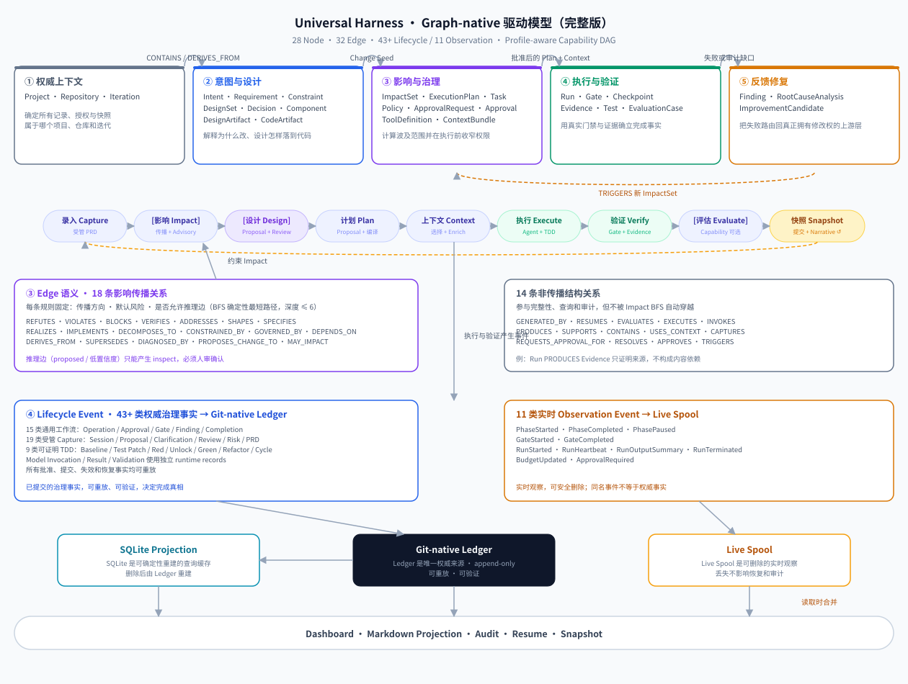
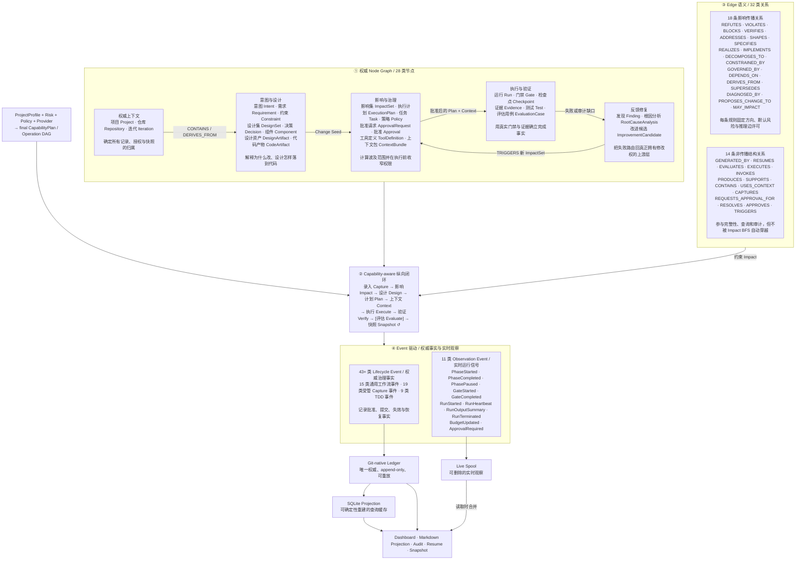
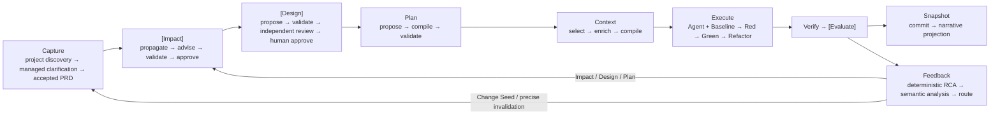
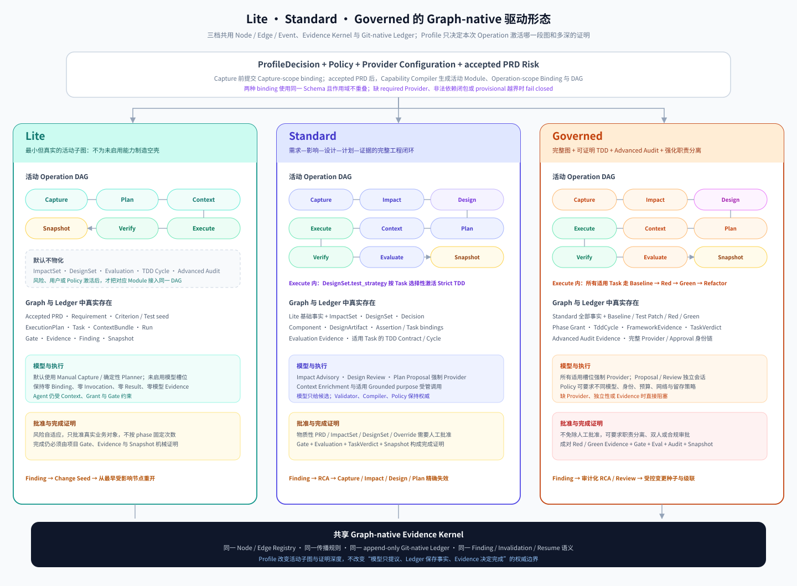
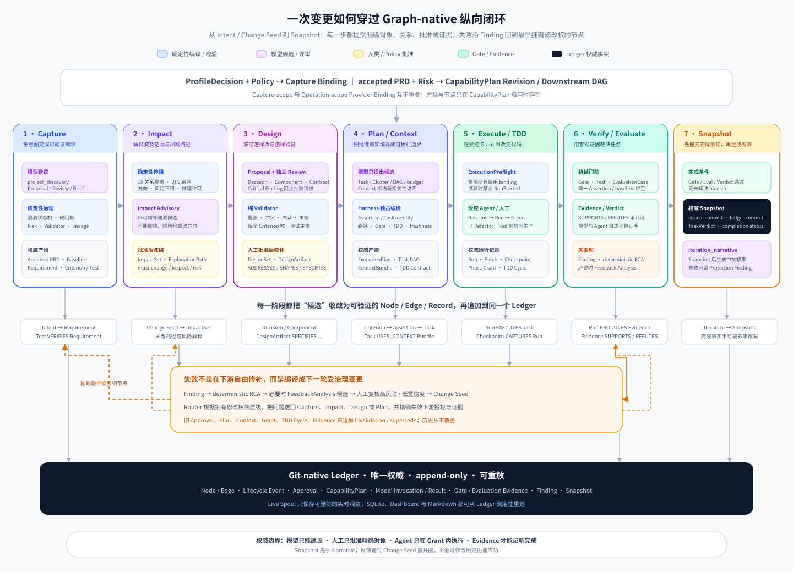

# Harness Graph-native 驱动模型

本文完整解释 Universal Harness 如何用 Node、Edge、Event、Profile-aware Capability DAG 与受管模型 Adapter 驱动一次可审计的软件迭代。代码中的 Schema、关系兼容矩阵、传播策略、Capability registry 和领域 Validator 是唯一权威来源；本文只提供中英双语的人类可读投影，不参与 Runtime 决策或 Ledger 写入。

实现状态（2026-08-23）：CapabilityPlan 已成为 Protocol 1.1 的生产路由权威，strict TDD 已通过 packaged CLI 的 Governed 纵向闭环产生 Baseline/Red/Green 同链 Evidence，FeedbackAnalysis 已接入 Verify/Evaluate/Audit 后、Change Seed 路由前的生产 runner。Lite / Standard / Governed 的 hermetic 三档闭环均完成；这证明本模型的仓库内接线，但不替代发布证据。M1 当前 27/28，AC25 仍等待同 commit Ubuntu/macOS/Windows CI 工件；本轮真实 DeepSeek 调用因未配置密钥为 `not_verified`。证据矩阵见 [全量评审修复完成证据](evidence/full-review-remediation-completion.md)。

## 0. 一张图理解完整 Harness 驱动模型



_如果上方 SVG 未渲染（例如纯文本阅读器），展开下面的 Mermaid 源码或继续阅读后文的 Node、Edge 和 Event 表格，语义完全等价。_

<details>
<summary>Mermaid 源码（文字降级，与 SVG 等价）</summary>



</details>

这张图分五层阅读：

1. **Profile 与 CapabilityPlan** 决定本次 Operation 真实启用哪些 Module、Provider、审批对象和 DAG 节点；Lite 不为未启用能力生成空壳。
2. **Node Graph** 定义 Harness 当前知道什么，以及需求、设计、执行、证据和反馈分别由谁负责。
3. **Edge 语义**决定对象怎样关联。18 条传播关系约束 Impact，14 条结构关系保存执行和审计事实但不自动扩散变更。
4. **Event 驱动**记录状态怎样变化。Lifecycle Event 证明已经提交的事实，Observation Event 展示此刻发生的事情。
5. **存储与读取**保持完成真相清晰：Ledger 是唯一权威来源；Live Spool 是可删除的实时观察；SQLite 是可确定性重建的查询缓存。

若当前 Markdown 阅读器中的 Mermaid 无法渲染，可先查看上方的 SVG 总览图，或展开 Mermaid 源码；后续 Node、Edge 和 Event 表格包含同一模型的完整文字降级，不会丢失语义。

### 0.1 Capability DAG 内的模型子状态

模型调用不新增公共 phase，也不拥有 Capability Node。它们作为现有 DAG 节点内部的受管子状态运行：



五个模型 Port 的权威边界固定如下：

| Port | 输入位置 | 结构化输出 | 不可越过的确定性边界 |
| --- | --- | --- | --- |
| `ImpactAdvisoryPort` | 确定性传播结果、受控图邻域、18 种关系规则 | 增补 Impact/Edge/Risk/Missing-fact 候选 | 不能删除确定性 entry、降低风险、改方向或激活禁止的推理边 |
| `DesignReviewPort` | 已通过纯 Validator 的 Design Proposal | `accept_recommended / revision_required / blocked` 与 Findings | Critical Finding 阻止 ApprovalRequest；Reviewer 无批准权 |
| `PlanProposalPort` | canonical Assertion descriptors、accepted PRD/Impact/Design、Gate/TDD/路径预算 | Task/Cluster/DAG/并行/Context budget 候选 | Harness 独占 Assertion 与 Task identity、路径、Gate、TDD Contract 和最终 DAG |
| `FeedbackAnalysisPort` | 未分类或冲突 RCA、Gate/Evaluation Evidence、上下游 bindings | Diagnosis/Change Seed/verification 候选、confidence、source refs | 不覆盖确定性 RCA，不决定 target layer、失效范围或 privileged route |
| `GroundedSynthesisPort` | 四种 purpose-bound 只读 Bundle | 带逐 claim 来源引用的结构化中文提炼 | 不修改 Graph、审批对象、Context 权限、Snapshot、Evidence 或 Verdict |

`GroundedSynthesisPort` 只允许四种固定 purpose：

| Purpose | 使用时机 | 产出 |
| --- | --- | --- |
| `project_discovery` | adopt 扫描后的受管 Capture 前 | 项目事实、候选 Capability/Gate、置信度与来源 |
| `context_enrichment` | 确定性 Context selection 后 | 术语、分段摘要、相关性解释与来源 |
| `approval_brief` | 真实批准对象和 Invocation 已提交后 | 变化、风险、权衡、待决问题与来源 |
| `iteration_narrative` | 权威 Snapshot 提交后 | 结果、Evidence、遗留风险、后续建议与来源 |

所有 Port/purpose 的 prompt、Schema、budget、conversation、run identity 和 Evidence 相互独立；可以共用 vendor/model/executable，但不能共享隐藏历史。Standard/Governed 对适用槽位强制 Provider，缺失或必需调用耗尽重试后阻塞；`iteration_narrative` 是唯一非阻塞例外，失败只产生可恢复 Projection Finding。

### 0.2 Lite、Standard、Governed 的 Graph-native 驱动形态



这三种形态不是三套 Orchestrator，也不是把同一条重流水线做界面隐藏。它们共用同一套 Node、Edge、Event、关系传播规则、Finding 反馈语义和 Git-native Ledger；差异来自 Capability Compiler 为本次 Operation 选择了不同的**活动子图**：

1. **DAG 节点不同**：只有 CapabilityPlan 实际启用的 Module 才向 Operation DAG 注册节点，未启用能力不会运行，也不会生成 placeholder checkpoint。
2. **图谱资产不同**：活动节点只在完成确定性校验、必要批准和原子提交后，才物化对应 Node、Edge 或领域 Record。未启用 Module 保持零工件，而不是写一个“跳过”对象冒充治理事实。
3. **模型槽位不同**：Provider Binding 跟随实际能力编译。模型只能生成候选、评审或带引用摘要，不能直接写 Graph、签发 Grant、批准对象或生成完成 Evidence。
4. **证明深度不同**：三档都必须用 Gate、Evidence 和 Snapshot 证明完成；Standard 增加 Impact、Design、Evaluation 与选择性 TDD，Governed 再增加完整 TDD、Advanced Audit 和强化身份/审批约束。

Profile 决定能力深度，但不改变 Evidence Kernel 的真实性：

| Profile | 典型 Capability DAG | 模型 Provider | 人工批准 |
| --- | --- | --- | --- |
| Lite | Capture → Plan → Context → Execute → Verify → Snapshot；风险/Policy 可临时激活高级 Module | 默认确定性 Kernel/Planner；未启用槽位零 binding/Invocation/Result | 风险自适应，只保留必要的真实业务对象批准 |
| Standard | Capture → Impact → Design → Plan → Context → Execute → Verify → Evaluate → Snapshot；按 test_strategy 选择 Strict TDD | Impact Advisory、Design Review、Plan Proposal 及适用 Grounded purpose 强制；Feedback 命中条件时强制 | 物质性 PRD/Impact/Design/Override 等对象人工批准 |
| Governed | Standard 全部能力 + 全适用 Task Strict TDD + Advanced Audit/更严 Policy | Standard 强制项全部启用，Policy 可要求 Proposal/Review 不同模型或更严留存 | 不免除批准，可要求职责分离或双人规则 |

#### Lite：最小但完整的 Graph-native 子图

Lite 默认只物化 `Capture → Plan → Context → Execute → Verify → Snapshot` 所需事实：accepted PRD、Requirement、Criterion/Test seed、ExecutionPlan、Task、ContextBundle、Run、Gate、Evidence、Finding 和 Snapshot。ImpactSet、DesignSet、Evaluation、TDD Cycle、Advanced Audit 以及对应模型调用全部为零。风险、用户或 Policy 要求升级时，Harness 不是切换到另一套流程，而是编译新的 CapabilityPlan revision，把所需 Module 接回同一个 DAG，并从最早受影响节点恢复。

#### Standard：完整工程治理图

Standard 默认把 `Impact`、`Design` 和 `Evaluate` 纳入活动图。需求变化先形成带解释路径和风险的 ImpactSet，再形成经独立 Review 与人工批准的 DesignSet；Plan 必须同时绑定 accepted PRD、冻结 ImpactSet、accepted DesignSet 和 final CapabilityPlan。`DesignSet.test_strategy` 决定哪些 Task 进入 Strict TDD 子图，模型 Provider 对适用的 Impact Advisory、Design Review、Plan Proposal 和 Grounded purpose 强制配置，但所有模型输出仍要经过确定性 Validator/Compiler。

#### Governed：最大证明深度的受治理图

Governed 在 Standard 图上强制所有适用 Task 形成可证明的 `Baseline → Red → Green → Refactor` 链，并增加 Advanced Audit、严格 Provider/Reviewer 身份、预算、网络、留存和批准策略。Ledger 必须保存 Phase Grant、canonical test patch、成对 Red/Green Evidence、Evaluation、TaskVerdict 与审计结果；人工批准不可免除，Policy 还可以要求 Proposal/Review 使用不同身份、职责分离或双人规则。

无论采用哪一档，Profile 都不能改变四条底线：**模型只提议，Graph 只物化 accepted 工程事实，Ledger 只追加不覆盖，Evidence 才能证明完成**。

三档图不是目标态自述。打包 CLI 的可复现 dogfood 已证明 Lite、Standard、Governed 都由各自 final CapabilityPlan 物化对应 DAG 并到达 completed Snapshot；Governed 完成 2 个 strict TDD cycle，Evidence 类型包含 `baseline_test_result`、`red_test_result`、`green_test_result`。Standard 的测试策略使用已批准 `non_executable_projection` exemption，因此明确投影为 `controlled_not_applicable`，不会用空的 TDD 工件伪造“已证明”。完整 Operation、Snapshot 和 digest 见 [三档 dogfood 证据](evidence/full-remediation-three-profile-dogfood.md)。

## 1. Node：Harness 当前知道什么

28 类 Node 分成五个职责域。它们共同回答：当前工作属于哪个项目和迭代、为什么修改、设计怎样冻结、准备怎样修改、实际发生了什么，以及失败应该回到哪一层修复。

<!-- graph-model:nodes:start -->

| Node | 中文名称 | 职责域 | 业务说明 |
| --- | --- | --- | --- |
| `Project` | 项目 | 权威上下文 | Harness 治理对象的顶层边界，聚合仓库、迭代和项目级策略。 |
| `Repository` | 仓库 | 权威上下文 | 绑定实际版本库和基线，提供代码、文档、提交与工作区事实。 |
| `Iteration` | 迭代 | 权威上下文 | 一次从需求录入到快照完成的受治理工作单元，承载阶段状态。 |
| `Intent` | 意图 | 意图与设计 | 保存用户原始目标和澄清结果，是需求分解的起点。 |
| `Requirement` | 需求 | 意图与设计 | 描述系统必须提供的业务能力或可验证结果。 |
| `Constraint` | 约束 | 意图与设计 | 描述安全、合规、性能、兼容性或工程边界。 |
| `DesignSet` | 设计集 | 意图与设计 | 聚合一次迭代批准的 Decision、Component、DesignArtifact 与关系边，是 impact → design → plan 的原子审批边界。 |
| `Decision` | 决策 | 意图与设计 | 记录为满足需求和约束而选择的架构或实现方向。 |
| `Component` | 组件 | 意图与设计 | 表示承担明确职责的系统模块或边界。 |
| `DesignArtifact` | 设计资产 | 意图与设计 | 保存 API/Data 契约、测试策略或 UI 设计；由 SPECIFIES 精确连接被规定对象。 |
| `CodeArtifact` | 代码产物 | 意图与设计 | 表示实现组件、需求或决策的源文件及其他代码对象。 |
| `ImpactSet` | 影响集 | 影响与治理 | 固化 Change Seed、解释路径、风险和需要修改或检查的对象。 |
| `ExecutionPlan` | 执行计划 | 影响与治理 | 把已批准影响分解为有依赖关系的声明式任务。 |
| `Task` | 任务 | 影响与治理 | 定义单个可执行工作单元的目标、范围、风险和验收标准。 |
| `Policy` | 策略 | 影响与治理 | 提供能力、风险、批准、预算和外部副作用的强制治理规则。 |
| `ApprovalRequest` | 批准请求 | 影响与治理 | 请求人类对精确对象 digest、风险和允许动作作出决定。 |
| `Approval` | 批准 | 影响与治理 | 保存人类决议，并把决议绑定到不可漂移的请求和对象摘要。 |
| `ToolDefinition` | 工具定义 | 影响与治理 | 声明执行器可以调用的工具契约、风险和控制属性。 |
| `ContextBundle` | 上下文包 | 影响与治理 | 为单个 Task 编译最小、受预算约束且带 freshness 的上下文。 |
| `Run` | 执行运行 | 执行与验证 | 保存一次直接、Agent 或人工执行的真实 outcome、handoff 和资源事实。 |
| `Gate` | 门禁 | 执行与验证 | 定义必须通过的确定性、项目级或可选 Judge 检查。 |
| `Checkpoint` | 检查点 | 执行与验证 | 捕获可恢复进度，使中断后重放不会复制记录或副作用。 |
| `Evidence` | 证据 | 执行与验证 | 保存门禁、测试、评估或工具结果对受治理对象的证明或反证。 |
| `Test` | 测试 | 执行与验证 | 描述验证需求或约束的可执行检查。 |
| `EvaluationCase` | 评估用例 | 执行与验证 | 描述对 Task 或 Run 的结果、安全、轨迹、效率和正确失败评估。 |
| `Finding` | 发现 | 反馈修复 | 把失败、审计缺口或风险转为可治理的问题记录。 |
| `RootCauseAnalysis` | 根因分析 | 反馈修复 | 判断 Finding 的根因、置信度和真正拥有修改权的上游层。 |
| `ImprovementCandidate` | 改进候选 | 反馈修复 | 提出可评审的定向改进，并在接受后触发新的影响分析。 |

<!-- graph-model:nodes:end -->

### 五个职责域

- **权威上下文**确定“在哪个项目、哪个仓库、哪次迭代”工作，是所有记录、授权和快照的归属根。
- **意图与设计**把自然语言目标变成 accepted PRD、需求、约束、DesignSet、决策、组件、设计资产和代码对象，形成“为什么改、批准了怎样的设计”的依据。
- **影响与治理**计算波及范围，把已批准影响转成任务，并在执行前收窄策略、能力、工具和上下文。
- **执行与验证**在受控能力内执行任务，用门禁、测试和评估产生证据；Agent 自述不能替代完成事实。
- **反馈修复**把失败升级为结构化问题，定位根因与归属层，再触发新影响分析，禁止下游越层改写上游事实。

## 2. Edge：对象怎样关联，变化怎样传播

32 类 Edge 共同构成 Artifact Graph 与 Execution Graph。它们不是同一种语义：18 类关系允许 Impact Engine 在规则约束下传播变更，另 14 类关系只表达结构、执行或审计事实。

### 2.1 18 条影响传播关系

当 `Requirement`、`Decision`、`CodeArtifact`、`Finding` 等节点成为 Change Seed 时，Impact Engine 不能沿全部相邻边盲目扩散。每条传播规则固定三个参数：

- **传播方向**站在当前被检查节点看：`forward` 只沿当前节点发出的边，`inverse` 只沿指向当前节点的边反向追溯，`both` 两侧均可。
- **默认风险**表示关系对路径风险的最低贡献。Change Seed 先按迭代类型取得基础风险；路径只要经过 `high` 关系，目标风险就提升为 `high`，普通关系不会把低风险重构无差别升级。
- **允许推理边**决定 proposed 或低置信度边能否进入候选路径。即使允许，路径一旦经过推理边，结果也只能进入 `inspect`，必须由人确认，不能自动成为确定性 `must-change`。

例如 `CodeArtifact REALIZES Component`。当组件发生变化时，`REALIZES` 使用 `inverse`，Impact Engine 从作为 target 的组件反向找到实现它的代码；关系本身是 `high` 风险，因此实现代码进入高风险复核范围。

<!-- graph-model:propagation-edges:start -->

| Relation | 中文含义 | Direction | Default risk | 允许推理边 | 传播说明 |
| --- | --- | --- | --- | --- | --- |
| `REFUTES` | 反证 | forward → | high | 否 | 证据推翻测试、需求或评估结论时，推动被反证对象进入高风险复核。 |
| `VIOLATES` | 违反 | forward → | high | 否 | Finding 指出需求、约束或策略被违反，必须沿事实方向升级处理。 |
| `BLOCKS` | 阻塞 | forward → | high | 否 | Finding 阻止 Task 或 Iteration 完成，直接传播高风险阻塞。 |
| `VERIFIES` | 验证 | both ↔ | medium | 是 | 测试和被验证需求或约束任一侧变化，都可能要求检查另一侧。 |
| `ADDRESSES` | 回应需求 | inverse ← | medium | 是 | 需求变化时反向找到回应它的 Decision；从 Decision 出发不顺向扩散到需求。 |
| `SHAPES` | 塑造组件 | forward → | medium | 是 | Decision 变化时顺向检查由它塑造的 Component。 |
| `SPECIFIES` | 具体规定 | both ↔ | high | 否 | DesignArtifact 与 Requirement、Decision、Component 或 Test 任一侧变化，都高风险检查对应契约或策略。 |
| `REALIZES` | 实现组件 | inverse ← | high | 是 | Component 变化时反向找到实现它的 CodeArtifact，并提升为高风险。 |
| `IMPLEMENTS` | 实施需求或决策 | inverse ← | medium | 是 | Requirement 或 Decision 变化时反向找到承担实现的 Task。 |
| `DECOMPOSES_TO` | 分解为 | forward → | medium | 否 | Intent 变化时顺向检查由它分解出的 Requirement。 |
| `CONSTRAINED_BY` | 受约束于 | both ↔ | high | 否 | 受治理对象或 Constraint 任一侧变化，都必须高风险检查另一侧。 |
| `GOVERNED_BY` | 受策略治理 | both ↔ | high | 否 | Policy 与受治理对象之间双向传播，防止策略变化被漏检。 |
| `DEPENDS_ON` | 依赖 | both ↔ | low | 否 | Task 依赖任一侧变化都进入低风险影响检查，环路由完整性审计阻止。 |
| `DERIVES_FROM` | 派生自 | inverse ← | medium | 否 | 上游版本化对象变化时，反向找到从它派生的下游对象。 |
| `SUPERSEDES` | 取代 | forward → | low | 否 | 新版本变化沿取代方向检查旧版本；纯重命名路径可保持 informational。 |
| `DIAGNOSED_BY` | 由根因分析诊断 | forward → | low | 否 | Finding 变化时顺向检查关联的 RootCauseAnalysis。 |
| `PROPOSES_CHANGE_TO` | 提议修改 | forward → | medium | 否 | ImprovementCandidate 被采纳或变化时，顺向定位建议修改的权威对象。 |
| `MAY_IMPACT` | 可能影响 | forward → | low | 是 | 语义索引或模型提出候选影响，只能形成 inspect 路径并等待人审。 |

<!-- graph-model:propagation-edges:end -->

传播采用按 ID 稳定排序的 BFS。相同图和 Change Seed 在每次重建中都会得到相同的最短解释路径；默认最大深度为 6，硬上限为 10。端点缺失由图完整性审计报告，Impact Engine 会忽略损坏边，不把它当作有效传播依据。

18 条关系还可以按业务目的理解：

- **失败与约束链**：`REFUTES`、`VIOLATES`、`BLOCKS` 把失败事实推向必须复核的对象。
- **需求—设计—实现链**：`VERIFIES`、`ADDRESSES`、`SHAPES`、`SPECIFIES`、`REALIZES`、`IMPLEMENTS`、`DECOMPOSES_TO` 连接意图、设计、契约、实现和验证。
- **治理与演化链**：`CONSTRAINED_BY`、`GOVERNED_BY`、`DEPENDS_ON`、`DERIVES_FROM`、`SUPERSEDES` 处理约束、策略、依赖和版本演化。
- **反馈修复链**：`DIAGNOSED_BY`、`PROPOSES_CHANGE_TO` 把失败路由回真正拥有修改权的上游层。
- **语义候选链**：`MAY_IMPACT` 允许模型或索引提出候选，但不允许其自我批准。

### 2.2 14 条非传播结构关系

非传播不等于不重要。这些 Edge 参加端点类型校验、状态过滤、图查询、Dashboard 邻域和审计追溯，但不表达“内容变化必然传递”，因此 Impact BFS 不会自动穿越。

例如 `Run PRODUCES Evidence` 只证明证据由该次运行产生。Evidence 内容变化时，不能据此推断 Run 对应 Task 的定义必须修改。把这种关系加入 BFS，会让运行历史、容器边和批准记录造成无界扩散。

<!-- graph-model:structural-edges:start -->

| Relation | 中文含义 | 分组 | 为什么存在但不传播 |
| --- | --- | --- | --- |
| `GENERATED_BY` | 由运行生成 | 来源与恢复 | 追踪版本化节点的生成来源，不表示生成者与产物互为内容依赖。 |
| `RESUMES` | 恢复自 | 来源与恢复 | 连接恢复 Run 和原 Run，保证审计连续，不把历史运行扩散为变更范围。 |
| `EVALUATES` | 评估 | 执行绑定 | 绑定 EvaluationCase 与 Task / Run，说明评估对象而非内容依赖。 |
| `EXECUTES` | 执行 | 执行绑定 | 说明 Run 执行哪个 Task、Gate 或 EvaluationCase，不据运行状态改写定义。 |
| `INVOKES` | 调用工具 | 执行绑定 | 记录 Run 使用的 ToolDefinition，用于能力审计而非影响传播。 |
| `PRODUCES` | 产生 | 产物与证据 | 连接 Run 与 Evidence，或 RCA 与 ImprovementCandidate，保存产物来源。 |
| `SUPPORTS` | 支持 | 产物与证据 | 表示 Evidence 支持 Test、Requirement 或 EvaluationCase 的结论。 |
| `CONTAINS` | 包含 | 层级归属 | 构建 Project、Repository、Iteration、ExecutionPlan 的包含视图，不代表内容依赖。 |
| `USES_CONTEXT` | 使用上下文 | 执行绑定 | 证明 Run 使用哪个 ContextBundle，供 freshness 与授权审计。 |
| `CAPTURES` | 捕获 | 执行绑定 | 连接 Checkpoint 与 Run / Iteration，服务恢复而不是变更传播。 |
| `REQUESTS_APPROVAL_FOR` | 请求批准 | 批准治理 | 把 ApprovalRequest 绑定到精确版本化对象。 |
| `RESOLVES` | 解决批准请求 | 批准治理 | 连接 Approval 与被决议的 ApprovalRequest，保留决策链。 |
| `APPROVES` | 批准对象 | 批准治理 | 把 Approval 绑定到精确对象 digest；对象漂移后批准失效。 |
| `TRIGGERS` | 触发影响分析 | 反馈入口 | 记录 Finding / ImprovementCandidate 触发的 ImpactSet；传播从新 Change Seed 重新开始。 |

<!-- graph-model:structural-edges:end -->

DesignSet 同时扩展既有关系端点：`DesignSet DERIVES_FROM ImpactSet` 绑定设计来源；`DesignSet CONTAINS Decision / Component / DesignArtifact` 聚合本次批准资产；`Task IMPLEMENTS Requirement / Decision / DesignArtifact` 证明任务实施哪些需求、决策和契约。Proposal 中的边在批准前只是 Ledger 候选，只有 DesignCommitter 原子提交后的 EdgeRecord 才能进入活动图和 Impact 传播。

## 3. Event：哪些事实已经发生，此刻又在发生什么

Harness 使用两条不同生命周期的事件流。43+ 类 Lifecycle Event 是写入 Git-native Ledger 的权威治理事实；11 类 Observation Event 是写入 Live Spool 的实时观察。两者可以在读取侧关联展示，但不能互相替代。

### 3.1 29 类权威 Lifecycle Event（16 类通用工作流事件 + 9 类 TDD 事件 + 4 类 M3 远程协作事件）

Lifecycle Event 记录一次受治理操作已经发生的关键里程碑。每条事件绑定 `project_id`、`iteration_id`、`workflow_operation_id`、`ledger_operation_id`、单调 `sequence`、`timestamp` 和结构化 `payload`。它们随 append-only Ledger 提交，可重放、可验证，并参与恢复、审计、投影和完成状态判断。

<!-- graph-model:lifecycle-events:start -->

| Event | 中文名称 | 分组 | 权威含义 |
| --- | --- | --- | --- |
| `OperationStarted` | 操作已开始 | 操作边界 | 建立一次幂等工作流的权威开始点。 |
| `PlanAccepted` | 计划已接受 | 计划与上下文 | 证明哪个声明式 ExecutionPlan 已获接受。 |
| `BeforeContextCompile` | 上下文编译前 | 计划与上下文 | 固化编译输入和 freshness 检查前的治理边界。 |
| `ContextCompiled` | 上下文已编译 | 计划与上下文 | 证明 Task 将使用哪个受限 ContextBundle。 |
| `BeforeToolCall` | 工具调用前 | 工具与批准 | 在发生外部动作前记录意图、参数摘要和控制条件。 |
| `AfterToolCall` | 工具调用后 | 工具与批准 | 记录工具结果、对账信息和副作用完成状态。 |
| `ApprovalRequired` | 需要批准 | 工具与批准 | 记录工作流因精确对象和风险需要人类决议。 |
| `CheckpointCommitted` | 检查点已提交 | 恢复与质量 | 证明可恢复进度已原子进入 Ledger。 |
| `CheckpointInvalidated` | 检查点已失效 | 恢复与质量 | 记录因上游权威对象变化而失效的旧进度，恢复时不得复用该检查点。 |
| `GateCompleted` | 门禁已完成 | 恢复与质量 | 保存门禁的最终治理结果，而不是仅显示实时进度。 |
| `EvaluationCompleted` | 评估已完成 | 恢复与质量 | 记录 Run / Task 的最终评估事实和证据绑定。 |
| `FindingCreated` | 发现已创建 | Finding 生命周期 | 把失败、风险或审计缺口追加为可治理问题。 |
| `FindingAccepted` | 发现已接受 | Finding 生命周期 | 记录人类接受 Finding 并进入后续处理。 |
| `FindingClosed` | 发现已关闭 | Finding 生命周期 | 记录问题已解决或不再活动，同时保留历史。 |
| `FindingSuperseded` | 发现已取代 | Finding 生命周期 | 记录 Finding 被更新事实取代，不删除旧记录。 |
| `OperationCompleted` | 操作已完成 | 操作边界 | 在所有必要事实提交后关闭一次工作流。 |
| `TddCycleStarted` | TDD 周期已开始 | 可证明 TDD | 绑定 TaskTddContract、Assertion、DesignSet、Plan、baseline 与 attempt。 |
| `TddBaselineAccepted` | TDD 基线已接受 | 可证明 TDD | 证明实现前基线健康，排除已有失败伪装成 Red。 |
| `TddTestPatchFrozen` | TDD 测试补丁已冻结 | 可证明 TDD | 冻结 canonical test patch；后续漂移使 Cycle 失效。 |
| `TddRedAccepted` | TDD Red 已接受 | 可证明 TDD | 证明同一测试按 Failure Oracle 得到预期失败。 |
| `TddImplementationUnlocked` | TDD 实现已解锁 | 可证明 TDD | Red 被接受后才签发 production write Grant。 |
| `TddGreenAccepted` | TDD Green 已接受 | 可证明 TDD | 证明同一 patch、Gate、framework 和 environment 已通过。 |
| `TddRefactorAccepted` | TDD 重构已接受 | 可证明 TDD | 记录不改变外部行为且完整门禁仍通过的重构。 |
| `TddCycleCompleted` | TDD 周期已完成 | 可证明 TDD | 形成当前有效的 Baseline/Red/Green 配对记录。 |
| `TddCycleInvalidated` | TDD 周期已失效 | 可证明 TDD | 任一 Contract、patch、Gate、environment 或上游 digest 漂移后使旧证明失效。 |
| `RemoteConnected` | 远程协作已连接 | 远程协作（M3） | 证明项目 Ledger 已接受 `active` CollaborationConnectionRecord，协作模式显式开启。 |
| `RemoteDisconnected` | 远程协作已断开 | 远程协作（M3） | 记录 `disconnected` revision 已接受，Control Ref 历史保留但权威远程写入停止。 |
| `RemoteApprovalMaterialized` | 远程批准已物化 | 远程协作（M3） | 证明一条合法 RemoteApprovalDecision 经本地重验证后物化为既有 ApprovalDecision。 |
| `IntegrationAccepted` | 集成已接受 | 远程协作（M3） | 证明候选 merge commit 已通过 Target Ref CAS 成为已接受事实。 |

<!-- graph-model:lifecycle-events:end -->

Lifecycle Event 是“已经提交了什么治理事实”。Dashboard、Projection、Audit 和 Resume 可以重放这些记录；实时通知即使名称相同，也不能替代 Ledger 中的事件。

### 3.2 19 类受管 Capture Lifecycle Event

Capture 的权威状态主要由 append-only record 与 checkpoint 重建；以下事件陈述已经提交的会话、澄清、评审、风险和接受事实：

| 分组 | Event | 权威含义 |
| --- | --- | --- |
| 会话与上下文 | `CaptureSessionStarted`、`ContextCompilationStarted`、`ContextCompilationCompleted` | 建立 Capture 会话，并固定 Proposal/Review purpose 的上下文编译边界。 |
| Proposal 与校验 | `PrdProposalRequested`、`PrdProposalReceived`、`PrdValidationCompleted` | 证明 Proposal 调用与确定性硬门禁结果。 |
| 澄清 | `ClarificationRequested`、`ClarificationAnswered` | 把 Question、Answer、session revision 和 SourceBinding 串成可复验 lineage。 |
| 独立评审 | `PrdReviewRequested`、`PrdReviewCompleted` | 记录与 Proposal 会话隔离的独立 Review。 |
| 风险与 Profile | `CaptureRiskAssessed`、`CaptureProfileRecommendationCreated` | 保存风险自适应批准输入与三档建议。 |
| 批准 | `PrdApprovalRequired`、`PrdApprovalDecisionApplied`、`PrdApprovalDeferred` | 将人类/Policy 决议绑定到精确 Proposal 与 object digest。 |
| 终态与修订 | `PrdAccepted`、`PrdRevisionRequested`、`CaptureBlocked`、`CaptureCancelled` | 记录不可变 accepted PRD、回退修订、typed blocker 或显式取消。 |

accepted PRD、RequirementBaseline、Intent/Requirement/Constraint/Test Nodes、lineage 和 Graph edges 在同一 Ledger transaction 原子提交；Review 通过或模型自述都不能单独产生 `PrdAccepted`。

### 3.3 9 类可证明 TDD Lifecycle Event

TDD 事件证明测试补丁冻结、Red/Green 顺序、生产写权限解锁和 Cycle 完成事实：

| Event | 权威含义 |
| --- | --- |
| `TddCycleStarted` | 绑定 TaskTddContract、Assertion、DesignSet、Plan、baseline 与 attempt。 |
| `TddBaselineAccepted` | 证明实现前基线健康，排除已有失败伪装成 Red。 |
| `TddTestPatchFrozen` | 冻结 canonical test patch；后续漂移使 Cycle 失效。 |
| `TddRedAccepted` | 证明同一测试按 Failure Oracle 得到预期失败。 |
| `TddImplementationUnlocked` | Red 被接受后才签发 production write Grant。 |
| `TddGreenAccepted` | 证明同一 patch、Gate、framework 和 environment 已通过。 |
| `TddRefactorAccepted` | 记录不改变外部行为且完整门禁仍通过的重构。 |
| `TddCycleCompleted` | 形成当前有效的 Baseline/Red/Green 配对记录。 |
| `TddCycleInvalidated` | 任一 Contract、patch、Gate、environment 或上游 digest 漂移后使旧证明失效。 |

这些事件与统一 Evidence Node、`TddCycleRecord` 和 `TaskVerdict` 配合，机械证明“先红再绿”；stdout、文件时间戳和 Agent 完成声明不参与 proof。

### 3.4 11 类实时 Observation Event

Observation Event 回答长运行过程“现在进行到哪里、是否仍有心跳、预算怎样变化、为什么暂停”。每条事件绑定 `stream_id`、单调 `sequence`、`observation_key`、project、iteration 和 workflow operation，写入可删除的 Live Spool。

<!-- graph-model:observation-events:start -->

| Event | 中文名称 | 分组 | 实时含义 |
| --- | --- | --- | --- |
| `PhaseStarted` | 相位已开始 | 相位进度 | Dashboard pipeline 进入新的编排相位。 |
| `PhaseCompleted` | 相位已完成 | 相位进度 | 当前相位实时结束，等待下一相位或权威提交。 |
| `PhasePaused` | 相位已暂停 | 相位进度 | 工作流因批准、预算、恢复或错误暂时停住。 |
| `GateStarted` | 门禁已开始 | 门禁进度 | 显示某个 Gate 正在运行及其开始时间。 |
| `GateCompleted` | 门禁实时完成 | 门禁进度 | 即时显示 Gate 结果；最终事实仍由 Ledger / Evidence 确立。 |
| `RunStarted` | 执行已开始 | Agent Run | 显示 Provider 或人工 Run 已进入活动状态。 |
| `RunHeartbeat` | 执行心跳 | Agent Run | 证明长运行 Provider 仍有活性，不代表 Task 已完成。 |
| `RunOutputSummary` | 执行输出摘要 | Agent Run | 提供节流、脱敏的进度摘要，不成为完成证据。 |
| `RunTerminated` | 执行已终止 | Agent Run | 即时显示完成、失败、取消或超时等终止原因。 |
| `BudgetUpdated` | 预算已更新 | 控制信号 | 展示 token、时间或工具预算的当前消耗和剩余量。 |
| `ApprovalRequired` | 实时等待批准 | 控制信号 | 提示用户需要处理 ApprovalRequest，不代替权威批准事件。 |

<!-- graph-model:observation-events:end -->

`GateCompleted` 和 `ApprovalRequired` 在两条流中可能同名，但语义不同：Observation Event 是即时通知，Lifecycle Event 是已提交治理事实。读取层按 workflow operation、stream sequence 和 Ledger sequence 关联展示，绝不把通知升级为权威状态。

Live Spool 可以安全删除。丢失 Observation Event 只影响实时体验，不影响 Ledger 重放、SQLite 重建、审计结论、Evidence 绑定或 Iteration Snapshot。

### 3.5 受管模型调用记录

模型调用状态通过 Ledger runtime records 留存，不为每个调用制造 Graph Node 或公共 phase：

```text
ModelInvocationPlanned
  → ModelInvocationStarted
  → ModelInvocationCompleted | ModelInvocationFailed | ModelInvocationIndeterminate
  → ModelResultValidated | ModelResultRejected
  → ModelResultConsumed | ModelResultInvalidated
```

`ModelInvocationRecord` 绑定 port/purpose、input/prompt/Schema/model/config/budget digest、conversation/run/attempt identity、token/step/duration、raw output artifact、normalized result 和 typed failure。领域结果分别保存在 `ImpactAdvisoryRecord`、`DesignReviewRecord`、`PlanProposalRecord`、`FeedbackAnalysisRecord` 与 `GroundedSynthesisRecord`；只有通过确定性 Validator、领域审批和原子提交后，accepted 工程事实才进入 Graph。

## 4. 一次变更如何穿过整条闭环



上图把一次变更拆成四个同时发生、但职责不同的层次：

- **最上层 Profile/Capability**分两次收窄运行边界：Capture 前由 ProfileDecision 和 Policy 提交 Capture-scope Provider Binding；accepted PRD 与风险确定后，再编译下游 CapabilityPlan、Operation-scope Binding 和 DAG。两类作用域互不重叠，方括号能力未启用时完全不物化。
- **中间七个阶段卡片**区分模型候选、确定性编译/校验、人工或 Policy 批准，以及每一阶段最终提交的权威产物。模型可以帮助发现、设计、分解和解释，但不能跨过蓝色确定性边界或黄色批准边界。
- **Node/Edge 事实带**展示对象怎样进入 Graph：Intent 分解为 Requirement，DesignArtifact 通过 `SPECIFIES` 固化契约，Task 绑定 Assertion 和 Context，Run 产生 Evidence，最终 Snapshot 固化完成事实。
- **橙色反馈环**表示失败不会在下游随意修补。Finding 先经过确定性 RCA，必要时接受模型语义候选和人工复核，再形成 Change Seed，路由到 Capture、Impact、Design 或 Plan 中最早拥有修改权的节点；旧授权和证据只追加失效记录。
- **底部 Ledger**接收所有已提交事实。Live Spool、SQLite、Dashboard 和 Markdown 都是观察或投影层，不能反向修改完成真相。

以下例子从一个已接受 `Requirement` 内容变化开始：

1. **Profile / Capture Binding**：用户确认 Lite、Standard 或 Governed。Capture 启动前，Harness 从 ProfileDecision、Policy、Provider 配置和 baseline 确定性提交 Capture-scope Binding；`project_discovery` 与 Capture 阶段 `approval_brief` 不等待也不伪造下游 CapabilityPlan。
2. **Capture**：adopt 时由 `project_discovery` 先提供带来源的项目事实候选；受管澄清状态机把 Intent 变成结构化 PrdProposal，经过硬门禁、独立 Review、风险评估和必要批准后，原子提交 accepted PRD、RequirementBaseline、Criterion/Test seeds 与 Graph facts。需求修订成为 Change Seed，旧 revision 不被覆盖。
3. **Capability Decision**：accepted PRD 和 CaptureRiskAssessment 提供完整风险输入。Capability Compiler 结合 Profile、Policy、Provider 和依赖闭包生成下游 CapabilityPlan revision；Standard 的 Strict TDD 可先保持 provisional，只有 accepted DesignSet.test_strategy 才能原子 finalization，任何 provisional 状态都不能越过 Plan guard。
4. **Impact**：确定性引擎从 Requirement 出发，沿 inverse `ADDRESSES`、forward `SHAPES`、both `SPECIFIES`、inverse `REALIZES` 和 inverse `IMPLEMENTS` 找到设计契约、组件、代码与任务，并对稳定最短路径累计风险。
5. **Impact Advisory**：模型只能增补遗漏候选和风险信号。Harness 拒绝删除确定性 entry、降低风险、改写传播方向、激活禁止推理边或缺少来源的结果；完整 ImpactSet 仍需统一校验和批准。
6. **Design**：DesignProposalPort 提出 Decision、Component、API/Data/UI 契约和 test_strategy；纯 Validator 检查覆盖、关系、冲突与风险；独立 DesignReviewPort 返回结构化 Findings。Critical Finding 阻止 ApprovalRequest，人工批准后 DesignCommitter 才原子物化 accepted DesignSet、DesignArtifact 和关系边；Standard 同事务提交 final CapabilityPlan revision。
7. **Plan**：Harness 先从每个原子 Criterion 确定性编译 canonical Assertion；PlanProposalPort 只建议 Task/Cluster/DAG/并行和 Context budget。Plan Compiler 独占 Assertion 与 Task identity、覆盖唯一性、路径、Gate、TDD Contract 和最终 DAG。
8. **Context**：确定性 selector 为每个 Task 选择最小、fresh、受预算约束的 ContextBundle；`context_enrichment` 只补充带来源的术语、摘要和相关性解释，不能删除 mandatory source 或扩大读取/执行权限。ExecutionPreflight 复验所有启用能力的 digest。
9. **Execute / TDD**：直接执行、受控 Agent 或人工在 CapabilityGrant 内工作。strict_tdd 适用时，隔离工作区固定执行 Baseline → 冻结测试补丁 → Red → 解锁 production Grant → Green → Refactor；Red 前无法写生产路径。
10. **Verify / Evaluate**：Gate、Test 与 EvaluationCase 形成 `Run PRODUCES Evidence`、`Evidence SUPPORTS / REFUTES ...` 审计链。TaskVerdict 逐 Assertion 消费当前有效 Evidence；Agent、模型或 transcript 的完成声明不能替代它。
11. **Feedback**：验证或评审失败创建 Finding。确定性 RCA 规则优先；只有未分类、多个信号冲突或 Policy 要求语义解释时才调用 FeedbackAnalysisPort。低置信度/高风险候选经人工复核后，Router 才决定 Capture/Impact/Design/Plan 的目标层和精确失效范围。
12. **Cascade**：已验证的 Change Seed 通过 `PROPOSES_CHANGE_TO` 和 `TRIGGERS` 回到真正拥有修改权的上游层；旧 Approval、Plan、Context、Grant、TDD Cycle 与 Evidence 只追加 invalidation/supersede，不改写历史。
13. **Snapshot**：所有必要 Gate、Evaluation、审计、TaskVerdict 和 Evidence 通过后，先提交权威 Snapshot，记录 source commit、ledger commit 和完成状态。
14. **Narrative**：`iteration_narrative` 在 Snapshot 之后生成带引用的结果、证据、遗留风险与后续建议。失败只创建可恢复 Projection Finding，不反向改变 Snapshot/Verdict。

这条链说明 Harness 的核心不是让 Agent 自由循环，而是让 Graph 提供可解释范围、让 Policy 和 Approval 提供控制、让 Event 与 Evidence 提供完成真相，再把失败可靠地反馈为下一轮受治理变化。

## 5. 权威边界与可重建投影

| 层 | 保存什么 | 是否决定完成真相 | 丢失后的影响 |
| --- | --- | --- | --- |
| Git-native Ledger | Node、Edge、Lifecycle Event、Profile/Capability/Capture/Design/TDD/Model Invocation records、批准、Evidence 和 Snapshot 等权威记录 | 是 | 必须从 Git 恢复，不能由缓存推断替代 |
| Live Spool | Phase、Run、Gate、预算、心跳和等待批准等 Observation Event | 否 | 只损失实时展示，不影响恢复和审计 |
| SQLite Projection | 从 Ledger 物化的分页、邻域、路径和 Dashboard 查询索引 | 否 | 删除后由 Ledger 确定性重建 |
| Markdown Projection | PRD、Architecture、Spec、Plan、tasks 和 Snapshot 的人类可读投影 | 否 | 检测漂移后从权威图重新生成 |

读取 Dashboard 时，服务可以把 Ledger 生命周期事实、SQLite 查询结果、受管模型用量/来源和 Live Spool 观察合并为一个视图。这个合并只发生在 Read API，不会把实时观察、模型摘要或缓存状态写回权威账本。Approval 卡片可优先展示 `approval_brief`，但必须同时保留 Harness 从 canonical object 确定性生成的对象、风险、范围和 digest。

## 6. 代码权威来源

- [Node Schema](../packages/core/src/schema/node.ts)：`NODE_TYPES`
- [Edge Schema](../packages/core/src/schema/edge.ts)：`RELATION_TYPES`
- [Edge 合法端点矩阵](../packages/graph/src/integrity.ts)：`RELATION_COMPATIBILITY`
- [影响传播策略](../packages/graph/src/impact/propagation.ts)：`PROPAGATION_RULES`
- [风险与分类](../packages/graph/src/impact/scoring.ts)：`must-change`、`inspect`、`informational`
- [Lifecycle Event Schema](../packages/core/src/schema/event.ts)：`EVENT_TYPES`
- [Observation Event Schema](../packages/core/src/schema/observation.ts)：`OBSERVATION_EVENT_TYPES`
- [Slim Profiles 与 Capability Kernel](superpowers/specs/2026-08-18-harness-slim-profiles-design.md)
- [受管 PRD Capture](superpowers/specs/2026-08-18-intent-to-prd-capture-design.md)
- [DesignSet 生命周期与 SPECIFIES](superpowers/specs/2026-08-18-designset-lifecycle-design.md)
- [可证明 TDD 事件与 Evidence](superpowers/specs/2026-08-18-provable-tdd-protocol-design.md)
- [模型建议 Adapter 与 Grounded Synthesis](superpowers/specs/2026-08-19-model-advisory-adapters-design.md)
- [Protocol 1.1 统一 19-task 计划](superpowers/plans/2026-08-18-protocol-1.1-unified-implementation-plan.md)

`RELATION_COMPATIBILITY` 决定某种 Edge 允许连接哪些 source / target Node 类型；`PROPAGATION_RULES` 决定 Impact Engine 是否以及怎样穿越其中 18 种关系。Capability registry 决定本次 Operation 是否物化 Impact、Design、Evaluation、Strict TDD、Audit 与对应模型 slot。合法端点不等于允许传播，模型建议也不等于 accepted Graph fact；关系注册表、CapabilityPlan、领域 Validator 与批准记录必须一起阅读。
