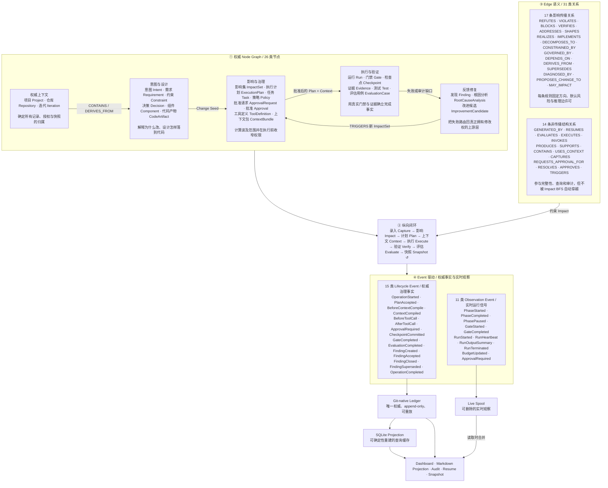

# Harness Graph-native 驱动模型

本文完整解释 Universal Harness 如何用 Node、Edge 与 Event 驱动一次可审计的软件迭代。代码中的 Schema、关系兼容矩阵和传播策略是唯一权威来源；本文只提供中英双语的人类可读投影，不参与 Runtime 决策或 Ledger 写入。

## 0. 一张图理解完整 Harness 驱动模型

这张图分四层阅读：

1. **Node Graph** 定义 Harness 当前知道什么，以及需求、设计、执行、证据和反馈分别由谁负责。
2. **Edge 语义**决定对象怎样关联。17 条传播关系约束 Impact，14 条结构关系保存执行和审计事实但不自动扩散变更。
3. **Event 驱动**记录状态怎样变化。Lifecycle Event 证明已经提交的事实，Observation Event 展示此刻发生的事情。
4. **存储与读取**保持完成真相清晰：Ledger 是唯一权威来源；Live Spool 是可删除的实时观察；SQLite 是可确定性重建的查询缓存。

若当前 Markdown 阅读器中的 Mermaid 无法渲染，后续 Node、Edge 和 Event 表格包含同一模型的完整文字降级，不会丢失语义。

## 1. Node：Harness 当前知道什么

26 类 Node 分成五个职责域。它们共同回答：当前工作属于哪个项目和迭代、为什么修改、准备怎样修改、实际发生了什么，以及失败应该回到哪一层修复。

<!-- graph-model:nodes:start -->

| Node | 中文名称 | 职责域 | 业务说明 |
| --- | --- | --- | --- |
| `Project` | 项目 | 权威上下文 | Harness 治理对象的顶层边界，聚合仓库、迭代和项目级策略。 |
| `Repository` | 仓库 | 权威上下文 | 绑定实际版本库和基线，提供代码、文档、提交与工作区事实。 |
| `Iteration` | 迭代 | 权威上下文 | 一次从需求录入到快照完成的受治理工作单元，承载阶段状态。 |
| `Intent` | 意图 | 意图与设计 | 保存用户原始目标和澄清结果，是需求分解的起点。 |
| `Requirement` | 需求 | 意图与设计 | 描述系统必须提供的业务能力或可验证结果。 |
| `Constraint` | 约束 | 意图与设计 | 描述安全、合规、性能、兼容性或工程边界。 |
| `Decision` | 决策 | 意图与设计 | 记录为满足需求和约束而选择的架构或实现方向。 |
| `Component` | 组件 | 意图与设计 | 表示承担明确职责的系统模块或边界。 |
| `CodeArtifact` | 代码产物 | 意图与设计 | 表示实现组件、需求或决策的源文件及其他代码对象。 |
| `ImpactSet` | 影响集 | 影响与治理 | 固化 Change Seed、解释路径、风险和需要修改或检查的对象。 |
| `ExecutionPlan` | 执行计划 | 影响与治理 | 把已批准影响分解为有依赖关系的声明式任务。 |
| `Task` | 任务 | 影响与治理 | 定义单个可执行工作单元的目标、范围、风险和验收标准。 |
| `Policy` | 策略 | 影响与治理 | 提供能力、风险、批准、预算和外部副作用的强制治理规则。 |
| `ApprovalRequest` | 批准请求 | 影响与治理 | 请求人类对精确对象 digest、风险和允许动作作出决定。 |
| `Approval` | 批准 | 影响与治理 | 保存人类决议，并把决议绑定到不可漂移的请求和对象摘要。 |
| `ToolDefinition` | 工具定义 | 影响与治理 | 声明执行器可以调用的工具契约、风险和控制属性。 |
| `ContextBundle` | 上下文包 | 影响与治理 | 为单个 Task 编译最小、受预算约束且带 freshness 的上下文。 |
| `Run` | 执行运行 | 执行与验证 | 保存一次直接、Agent 或人工执行的真实 outcome、handoff 和资源事实。 |
| `Gate` | 门禁 | 执行与验证 | 定义必须通过的确定性、项目级或可选 Judge 检查。 |
| `Checkpoint` | 检查点 | 执行与验证 | 捕获可恢复进度，使中断后重放不会复制记录或副作用。 |
| `Evidence` | 证据 | 执行与验证 | 保存门禁、测试、评估或工具结果对受治理对象的证明或反证。 |
| `Test` | 测试 | 执行与验证 | 描述验证需求或约束的可执行检查。 |
| `EvaluationCase` | 评估用例 | 执行与验证 | 描述对 Task 或 Run 的结果、安全、轨迹、效率和正确失败评估。 |
| `Finding` | 发现 | 反馈修复 | 把失败、审计缺口或风险转为可治理的问题记录。 |
| `RootCauseAnalysis` | 根因分析 | 反馈修复 | 判断 Finding 的根因、置信度和真正拥有修改权的上游层。 |
| `ImprovementCandidate` | 改进候选 | 反馈修复 | 提出可评审的定向改进，并在接受后触发新的影响分析。 |

<!-- graph-model:nodes:end -->

### 五个职责域

- **权威上下文**确定“在哪个项目、哪个仓库、哪次迭代”工作，是所有记录、授权和快照的归属根。
- **意图与设计**把自然语言目标变成需求、约束、决策、组件和代码对象，形成“为什么改”的依据。
- **影响与治理**计算波及范围，把已批准影响转成任务，并在执行前收窄策略、能力、工具和上下文。
- **执行与验证**在受控能力内执行任务，用门禁、测试和评估产生证据；Agent 自述不能替代完成事实。
- **反馈修复**把失败升级为结构化问题，定位根因与归属层，再触发新影响分析，禁止下游越层改写上游事实。

## 2. Edge：对象怎样关联，变化怎样传播

31 类 Edge 共同构成 Artifact Graph 与 Execution Graph。它们不是同一种语义：17 类关系允许 Impact Engine 在规则约束下传播变更，另 14 类关系只表达结构、执行或审计事实。

### 2.1 17 条影响传播关系

当 `Requirement`、`Decision`、`CodeArtifact`、`Finding` 等节点成为 Change Seed 时，Impact Engine 不能沿全部相邻边盲目扩散。每条传播规则固定三个参数：

- **传播方向**站在当前被检查节点看：`forward` 只沿当前节点发出的边，`inverse` 只沿指向当前节点的边反向追溯，`both` 两侧均可。
- **默认风险**表示关系对路径风险的最低贡献。Change Seed 先按迭代类型取得基础风险；路径只要经过 `high` 关系，目标风险就提升为 `high`，普通关系不会把低风险重构无差别升级。
- **允许推理边**决定 proposed 或低置信度边能否进入候选路径。即使允许，路径一旦经过推理边，结果也只能进入 `inspect`，必须由人确认，不能自动成为确定性 `must-change`。

例如 `CodeArtifact REALIZES Component`。当组件发生变化时，`REALIZES` 使用 `inverse`，Impact Engine 从作为 target 的组件反向找到实现它的代码；关系本身是 `high` 风险，因此实现代码进入高风险复核范围。

<!-- graph-model:propagation-edges:start -->

| Relation | 中文含义 | Direction | Default risk | 允许推理边 | 传播说明 |
| --- | --- | --- | --- | --- | --- |
| `REFUTES` | 反证 | forward → | high | 否 | 证据推翻测试、需求或评估结论时，推动被反证对象进入高风险复核。 |
| `VIOLATES` | 违反 | forward → | high | 否 | Finding 指出需求、约束或策略被违反，必须沿事实方向升级处理。 |
| `BLOCKS` | 阻塞 | forward → | high | 否 | Finding 阻止 Task 或 Iteration 完成，直接传播高风险阻塞。 |
| `VERIFIES` | 验证 | both ↔ | medium | 是 | 测试和被验证需求或约束任一侧变化，都可能要求检查另一侧。 |
| `ADDRESSES` | 回应需求 | inverse ← | medium | 是 | 需求变化时反向找到回应它的 Decision；从 Decision 出发不顺向扩散到需求。 |
| `SHAPES` | 塑造组件 | forward → | medium | 是 | Decision 变化时顺向检查由它塑造的 Component。 |
| `REALIZES` | 实现组件 | inverse ← | high | 是 | Component 变化时反向找到实现它的 CodeArtifact，并提升为高风险。 |
| `IMPLEMENTS` | 实施需求或决策 | inverse ← | medium | 是 | Requirement 或 Decision 变化时反向找到承担实现的 Task。 |
| `DECOMPOSES_TO` | 分解为 | forward → | medium | 否 | Intent 变化时顺向检查由它分解出的 Requirement。 |
| `CONSTRAINED_BY` | 受约束于 | both ↔ | high | 否 | 受治理对象或 Constraint 任一侧变化，都必须高风险检查另一侧。 |
| `GOVERNED_BY` | 受策略治理 | both ↔ | high | 否 | Policy 与受治理对象之间双向传播，防止策略变化被漏检。 |
| `DEPENDS_ON` | 依赖 | both ↔ | low | 否 | Task 依赖任一侧变化都进入低风险影响检查，环路由完整性审计阻止。 |
| `DERIVES_FROM` | 派生自 | inverse ← | medium | 否 | 上游版本化对象变化时，反向找到从它派生的下游对象。 |
| `SUPERSEDES` | 取代 | forward → | low | 否 | 新版本变化沿取代方向检查旧版本；纯重命名路径可保持 informational。 |
| `DIAGNOSED_BY` | 由根因分析诊断 | forward → | low | 否 | Finding 变化时顺向检查关联的 RootCauseAnalysis。 |
| `PROPOSES_CHANGE_TO` | 提议修改 | forward → | medium | 否 | ImprovementCandidate 被采纳或变化时，顺向定位建议修改的权威对象。 |
| `MAY_IMPACT` | 可能影响 | forward → | low | 是 | 语义索引或模型提出候选影响，只能形成 inspect 路径并等待人审。 |

<!-- graph-model:propagation-edges:end -->

传播采用按 ID 稳定排序的 BFS。相同图和 Change Seed 在每次重建中都会得到相同的最短解释路径；默认最大深度为 6，硬上限为 10。端点缺失由图完整性审计报告，Impact Engine 会忽略损坏边，不把它当作有效传播依据。

17 条关系还可以按业务目的理解：

- **失败与约束链**：`REFUTES`、`VIOLATES`、`BLOCKS` 把失败事实推向必须复核的对象。
- **需求—设计—实现链**：`VERIFIES`、`ADDRESSES`、`SHAPES`、`REALIZES`、`IMPLEMENTS`、`DECOMPOSES_TO` 连接意图、设计、实现和验证。
- **治理与演化链**：`CONSTRAINED_BY`、`GOVERNED_BY`、`DEPENDS_ON`、`DERIVES_FROM`、`SUPERSEDES` 处理约束、策略、依赖和版本演化。
- **反馈修复链**：`DIAGNOSED_BY`、`PROPOSES_CHANGE_TO` 把失败路由回真正拥有修改权的上游层。
- **语义候选链**：`MAY_IMPACT` 允许模型或索引提出候选，但不允许其自我批准。

### 2.2 14 条非传播结构关系

非传播不等于不重要。这些 Edge 参加端点类型校验、状态过滤、图查询、Dashboard 邻域和审计追溯，但不表达“内容变化必然传递”，因此 Impact BFS 不会自动穿越。

例如 `Run PRODUCES Evidence` 只证明证据由该次运行产生。Evidence 内容变化时，不能据此推断 Run 对应 Task 的定义必须修改。把这种关系加入 BFS，会让运行历史、容器边和批准记录造成无界扩散。

<!-- graph-model:structural-edges:start -->

| Relation | 中文含义 | 分组 | 为什么存在但不传播 |
| --- | --- | --- | --- |
| `GENERATED_BY` | 由运行生成 | 来源与恢复 | 追踪版本化节点的生成来源，不表示生成者与产物互为内容依赖。 |
| `RESUMES` | 恢复自 | 来源与恢复 | 连接恢复 Run 和原 Run，保证审计连续，不把历史运行扩散为变更范围。 |
| `EVALUATES` | 评估 | 执行绑定 | 绑定 EvaluationCase 与 Task / Run，说明评估对象而非内容依赖。 |
| `EXECUTES` | 执行 | 执行绑定 | 说明 Run 执行哪个 Task、Gate 或 EvaluationCase，不据运行状态改写定义。 |
| `INVOKES` | 调用工具 | 执行绑定 | 记录 Run 使用的 ToolDefinition，用于能力审计而非影响传播。 |
| `PRODUCES` | 产生 | 产物与证据 | 连接 Run 与 Evidence，或 RCA 与 ImprovementCandidate，保存产物来源。 |
| `SUPPORTS` | 支持 | 产物与证据 | 表示 Evidence 支持 Test、Requirement 或 EvaluationCase 的结论。 |
| `CONTAINS` | 包含 | 层级归属 | 构建 Project、Repository、Iteration、ExecutionPlan 的包含视图，不代表内容依赖。 |
| `USES_CONTEXT` | 使用上下文 | 执行绑定 | 证明 Run 使用哪个 ContextBundle，供 freshness 与授权审计。 |
| `CAPTURES` | 捕获 | 执行绑定 | 连接 Checkpoint 与 Run / Iteration，服务恢复而不是变更传播。 |
| `REQUESTS_APPROVAL_FOR` | 请求批准 | 批准治理 | 把 ApprovalRequest 绑定到精确版本化对象。 |
| `RESOLVES` | 解决批准请求 | 批准治理 | 连接 Approval 与被决议的 ApprovalRequest，保留决策链。 |
| `APPROVES` | 批准对象 | 批准治理 | 把 Approval 绑定到精确对象 digest；对象漂移后批准失效。 |
| `TRIGGERS` | 触发影响分析 | 反馈入口 | 记录 Finding / ImprovementCandidate 触发的 ImpactSet；传播从新 Change Seed 重新开始。 |

<!-- graph-model:structural-edges:end -->

## 3. Event：哪些事实已经发生，此刻又在发生什么

Harness 使用两条不同生命周期的事件流。Lifecycle Event 是写入 Git-native Ledger 的权威治理事实；Observation Event 是写入 Live Spool 的实时观察。两者可以在读取侧关联展示，但不能互相替代。

### 3.1 15 类权威 Lifecycle Event

Lifecycle Event 记录一次受治理操作已经发生的关键里程碑。每条事件绑定 `project_id`、`iteration_id`、`workflow_operation_id`、`ledger_operation_id`、单调 `sequence`、`timestamp` 和结构化 `payload`。它们随 append-only Ledger 提交，可重放、可验证，并参与恢复、审计、投影和完成状态判断。

<!-- graph-model:lifecycle-events:start -->

| Event | 中文名称 | 分组 | 权威含义 |
| --- | --- | --- | --- |
| `OperationStarted` | 操作已开始 | 操作边界 | 建立一次幂等工作流的权威开始点。 |
| `PlanAccepted` | 计划已接受 | 计划与上下文 | 证明哪个声明式 ExecutionPlan 已获接受。 |
| `BeforeContextCompile` | 上下文编译前 | 计划与上下文 | 固化编译输入和 freshness 检查前的治理边界。 |
| `ContextCompiled` | 上下文已编译 | 计划与上下文 | 证明 Task 将使用哪个受限 ContextBundle。 |
| `BeforeToolCall` | 工具调用前 | 工具与批准 | 在发生外部动作前记录意图、参数摘要和控制条件。 |
| `AfterToolCall` | 工具调用后 | 工具与批准 | 记录工具结果、对账信息和副作用完成状态。 |
| `ApprovalRequired` | 需要批准 | 工具与批准 | 记录工作流因精确对象和风险需要人类决议。 |
| `CheckpointCommitted` | 检查点已提交 | 恢复与质量 | 证明可恢复进度已原子进入 Ledger。 |
| `GateCompleted` | 门禁已完成 | 恢复与质量 | 保存门禁的最终治理结果，而不是仅显示实时进度。 |
| `EvaluationCompleted` | 评估已完成 | 恢复与质量 | 记录 Run / Task 的最终评估事实和证据绑定。 |
| `FindingCreated` | 发现已创建 | Finding 生命周期 | 把失败、风险或审计缺口追加为可治理问题。 |
| `FindingAccepted` | 发现已接受 | Finding 生命周期 | 记录人类接受 Finding 并进入后续处理。 |
| `FindingClosed` | 发现已关闭 | Finding 生命周期 | 记录问题已解决或不再活动，同时保留历史。 |
| `FindingSuperseded` | 发现已取代 | Finding 生命周期 | 记录 Finding 被更新事实取代，不删除旧记录。 |
| `OperationCompleted` | 操作已完成 | 操作边界 | 在所有必要事实提交后关闭一次工作流。 |

<!-- graph-model:lifecycle-events:end -->

Lifecycle Event 是“已经提交了什么治理事实”。Dashboard、Projection、Audit 和 Resume 可以重放这些记录；实时通知即使名称相同，也不能替代 Ledger 中的事件。

### 3.2 11 类实时 Observation Event

Observation Event 回答长运行过程“现在进行到哪里、是否仍有心跳、预算怎样变化、为什么暂停”。每条事件绑定 `stream_id`、单调 `sequence`、`observation_key`、project、iteration 和 workflow operation，写入可删除的 Live Spool。

<!-- graph-model:observation-events:start -->

| Event | 中文名称 | 分组 | 实时含义 |
| --- | --- | --- | --- |
| `PhaseStarted` | 相位已开始 | 相位进度 | Dashboard pipeline 进入新的编排相位。 |
| `PhaseCompleted` | 相位已完成 | 相位进度 | 当前相位实时结束，等待下一相位或权威提交。 |
| `PhasePaused` | 相位已暂停 | 相位进度 | 工作流因批准、预算、恢复或错误暂时停住。 |
| `GateStarted` | 门禁已开始 | 门禁进度 | 显示某个 Gate 正在运行及其开始时间。 |
| `GateCompleted` | 门禁实时完成 | 门禁进度 | 即时显示 Gate 结果；最终事实仍由 Ledger / Evidence 确立。 |
| `RunStarted` | 执行已开始 | Agent Run | 显示 Provider 或人工 Run 已进入活动状态。 |
| `RunHeartbeat` | 执行心跳 | Agent Run | 证明长运行 Provider 仍有活性，不代表 Task 已完成。 |
| `RunOutputSummary` | 执行输出摘要 | Agent Run | 提供节流、脱敏的进度摘要，不成为完成证据。 |
| `RunTerminated` | 执行已终止 | Agent Run | 即时显示完成、失败、取消或超时等终止原因。 |
| `BudgetUpdated` | 预算已更新 | 控制信号 | 展示 token、时间或工具预算的当前消耗和剩余量。 |
| `ApprovalRequired` | 实时等待批准 | 控制信号 | 提示用户需要处理 ApprovalRequest，不代替权威批准事件。 |

<!-- graph-model:observation-events:end -->

`GateCompleted` 和 `ApprovalRequired` 在两条流中可能同名，但语义不同：Observation Event 是即时通知，Lifecycle Event 是已提交治理事实。读取层按 workflow operation、stream sequence 和 Ledger sequence 关联展示，绝不把通知升级为权威状态。

Live Spool 可以安全删除。丢失 Observation Event 只影响实时体验，不影响 Ledger 重放、SQLite 重建、审计结论、Evidence 绑定或 Iteration Snapshot。

## 4. 一次变更如何穿过整条闭环

以下例子从一个已接受 `Requirement` 内容变化开始：

1. **Capture** 把需求修订记录为 Change Seed，并保留旧 revision，不覆盖历史。
2. **Impact** 从 Requirement 出发：沿 inverse `ADDRESSES` 找到回应需求的 Decision；再沿 forward `SHAPES` 找到 Component；从 Component 沿 inverse `REALIZES` 找到 CodeArtifact；同时沿 inverse `IMPLEMENTS` 找到承担实现的 Task。
3. Impact Engine 对每条最短解释路径累计风险。若路径经过 high-risk `REALIZES`，目标至少是 high risk；若经过 proposed 或低置信度推理边，目标只能进入 `inspect`。
4. 结果固化为 proposed `ImpactSet`。只有内容 digest 获得有效 Approval 后，Planning 才能据此生成声明式 `ExecutionPlan` 和原子 `Task`。
5. **Context** 为每个 Task 编译最小 `ContextBundle`，Policy、Approval、Impact coverage、能力和预算在 RunStarted 前共同形成执行授权。
6. **Execute** 由直接执行、受控 Agent Adapter 或人工完成。`Run` 记录 Provider 的真实 outcome；Checkpoint 支持中断恢复，工具调用前后写入权威生命周期事件。
7. **Verify / Evaluate** 执行 Gate、Test 与 EvaluationCase，并形成 `Run PRODUCES Evidence`、`Evidence SUPPORTS / REFUTES ...` 的审计链。Agent 的完成声明不能替代 Gate 和 Evidence。
8. 若验证失败，系统创建 `Finding → RootCauseAnalysis → ImprovementCandidate`。改进候选通过 `PROPOSES_CHANGE_TO` 指向真正的上游对象，并用 `TRIGGERS` 记录新的 ImpactSet，重新进入 Impact，而不是由下游相位越权改写需求或架构。
9. 所有必要 Gate、Evaluation、审计和 Evidence 通过后，**Snapshot** 记录 source commit、ledger commit 和完成状态；否则生成 blocked 状态并路由到对应上游相位。

这条链说明 Harness 的核心不是让 Agent 自由循环，而是让 Graph 提供可解释范围、让 Policy 和 Approval 提供控制、让 Event 与 Evidence 提供完成真相，再把失败可靠地反馈为下一轮受治理变化。

## 5. 权威边界与可重建投影

| 层 | 保存什么 | 是否决定完成真相 | 丢失后的影响 |
| --- | --- | --- | --- |
| Git-native Ledger | Node、Edge、Lifecycle Event、批准、Evidence 和 Snapshot 等权威记录 | 是 | 必须从 Git 恢复，不能由缓存推断替代 |
| Live Spool | Phase、Run、Gate、预算、心跳和等待批准等 Observation Event | 否 | 只损失实时展示，不影响恢复和审计 |
| SQLite Projection | 从 Ledger 物化的分页、邻域、路径和 Dashboard 查询索引 | 否 | 删除后由 Ledger 确定性重建 |
| Markdown Projection | PRD、Architecture、Spec、Plan、tasks 和 Snapshot 的人类可读投影 | 否 | 检测漂移后从权威图重新生成 |

读取 Dashboard 时，服务可以把 Ledger 生命周期事实、SQLite 查询结果和 Live Spool 观察合并为一个视图。这个合并只发生在 Read API，不会把实时观察或缓存状态写回权威账本。

## 6. 代码权威来源

- [Node Schema](../packages/core/src/schema/node.ts)：`NODE_TYPES`
- [Edge Schema](../packages/core/src/schema/edge.ts)：`RELATION_TYPES`
- [Edge 合法端点矩阵](../packages/graph/src/integrity.ts)：`RELATION_COMPATIBILITY`
- [影响传播策略](../packages/graph/src/impact/propagation.ts)：`PROPAGATION_RULES`
- [风险与分类](../packages/graph/src/impact/scoring.ts)：`must-change`、`inspect`、`informational`
- [Lifecycle Event Schema](../packages/core/src/schema/event.ts)：`EVENT_TYPES`
- [Observation Event Schema](../packages/core/src/schema/observation.ts)：`OBSERVATION_EVENT_TYPES`

`RELATION_COMPATIBILITY` 决定某种 Edge 允许连接哪些 source / target Node 类型；`PROPAGATION_RULES` 决定 Impact Engine 是否以及怎样穿越其中 17 种关系。合法端点不等于允许传播，这两个注册表必须同时阅读。
