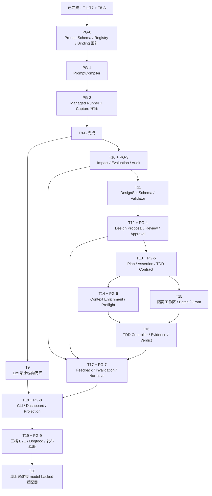

当前状态是：T1–T19 + PG-0–PG-9 已全部完成（发布验收止于 `9d0e3bf`）。其后又落地了 Managed 模型 Provider 层（`77d0131`：OpenAI 兼容 provider、槽位 registry、`model_providers` 配置与 CLI 装配）和架构文档（`ae0d448`）。下一项是 T20。

````

````

## 建议执行顺序

### 第一批：补完 T8 模型运行基础（已完成）

严格串行：

1. PG-0：Prompt Contract、Registry、Binding Schema 回补
2. PG-1：PromptCompiler、安全分区、Policy Overlay、Preparation Failure
3. PG-2：ManagedModelInvocationRunner、Invocation Evidence、T5/T7 接线

完成 PG-2 后，T8-B 才完成，所有后续模型 Port 才有统一运行底座。

### 第二批：先证明 Lite 最小闭环（已完成）

1. T9：Lite Kernel-only 完整纵向闭环

虽然 T9 与 T10 技术上都只依赖 T8，但建议先完成 T9。它负责证明：

- 未启用能力零节点、零工件、零 Prompt 编译；
- Capture → Plan → Context → Execute → Verify → Snapshot 可独立工作；
- 新的 Prompt Governance 没有把 Lite 重新变重。

### 第三批：建立 Impact → Design → Plan 主干（已完成）

1. T10 + PG-3：Impact Advisory、Evaluation、Audit contributors  
2. T11：DesignSet Schema、覆盖规则、纯 Validator  
3. T12 + PG-4：Design Proposal、独立 Review、人工批准、原子提交  
4. T13 + PG-5：Plan Proposal、Criterion→Assertion、TaskTddContract

这一段必须串行，因为：

```
冻结 ImpactSet
→ 才能设计 DesignSet
→ accepted DesignSet
→ 才能编译 Plan 和 TDD Contract
```

### 第四批：形成可证明执行（已完成）

T13 后出现唯一适合并行的分支：

1. T14 + PG-6：Context Enrichment、ExecutionPreflight  
2. T15：隔离工作区、测试补丁、Phase Grant

两者都完成后：

1. T16：Baseline → Red → Green → Refactor、Evidence、TaskVerdict

若单线程实施，建议按 `T14 → T15 → T16`；若并行开发，T14 和 T15 可以同时进行，但必须避免共同修改 execution-preflight/authorization 接口。

### 第五批：反馈闭环、产品入口和发布（已完成）

1. T17 + PG-7：FeedbackAnalysis、Finding 级联、失效、迁移、Iteration Narrative  
2. T18 + PG-8：CLI、Adapter、Read API、Dashboard、Prompt provenance  
3. T19 + PG-9：Lite/Standard/Governed E2E、真实 Provider dogfood、安全与发布门禁

### 第六批：流水线改接 model-backed 适配器

1. T20：capture/design/impact 主流水线改接 model-backed 适配器

背景：PG-2 起 model-backed 适配器已建好但刻意不接生产流量（legacy 兼容期为一个 major，新旧同时配置 fail closed）。Managed Provider 层（`77d0131`）落地后，改接的前提已经具备。

任务卡：

1. **capture**：`runtime-service` 的 capture 流程按 `model_providers` 配置选择 model-backed 端口（PrdProposal/PrdReview/project discovery/approval brief）；Standard/Governed 的 required 槽位缺失直接 blocked，Lite 非模型路径保持零 Prompt 编译、零 Provider 调用。
2. **design/impact**：PG-3/PG-4 的 model-backed 适配器（impact advisory、design proposal/review）同样按槽位接线；legacy adapter 退为显式 opt-in。
3. **迁移语义**：无 `model_providers` 的既有项目维持 legacy 路径并输出弃用告警；声明了配置但槽位无覆盖时 fail closed，不设隐式优先级。
4. **验收**：三档 profile 各跑一遍真实 Provider dogfood（一并消掉 T19 留下的外部条件留白，需有效 API key 与外网）。

## 当前最近的提交目标

```
feat(cli): route capture through model-backed adapters    # T20 切片 1（e7475ad，已完成）
feat(cli): route design/impact through model-backed ports # T20 切片 2（2ee8f84，已完成）
test(release): three-profile real provider dogfood        # T20 切片 3（已完成，证据 docs/evidence/t20-real-provider-dogfood.md）
```

切片 3 完成备注：三档真实 dogfood（deepseek-v4-pro）跑通，证据含
before/after 对照；dogfood 暴露并已修复三个缺口（`ef2d9e4`：output schema
嵌入编译提示词、invocation budget 贯通、capture memo）。同时产出三个
后续事项：

1. **T21 候选：design 端口输入保真**（已落地 `4aade1b`）。design 适配器新增
   `node_content` 解析，must-change 需求与 criterion/test 节点内容分项进入
   提示词；CLI 经物化图解析，缺失即 fail-closed。重跑后真实模型正常产出
   design 草案（consumed）。
2. **T21 候选：pipeline 端口输入编译保真与分项**（已落地 `4aade1b`）。
   advisory 整图单 item 改为摘要 + 每节点独立 item，governed 档尺寸合规。
3. **T22：prompt 契约的领域规则遵从度**（三轮迭代已落地，standard 档 design
   全链真实跑通：proposal/review 均 consumed，review 给出实质性
   revision_required；governed 到达 review，残余 review 引用保真
   unknown_affected_target）。后续每轮 prompt 迭代用
   `scripts/dogfood-real-provider.mjs` 回归。
3. **Capture-scope 槽位生产接线**（已完成）：prd_review /
   project_discovery / approval_brief 随 protocol-1.1 capture coordinator
   迁移落地——切片 1 生产装配（`managed-capture-coordinator.ts`），切片 2
   orchestrator 门控切换（有 profile + model_providers 的项目 capture 全程
   走 coordinator，approval 桥复用引擎决策账本；无配置/无 profile 保持
   legacy）。`criterion_test_pairs` 在 coordinator 路径下非空。

## T23：引用保真 prompt 迭代（已完成）

两类残余引用造假（`unknown_affected_target` / `citation_invalid`）经四轮
真实 dogfood 收敛；根因修复包括 synthesis-input 注入 `bundle_sources`
清单、grounded invocation id 保留 purpose、plan 端口 `node_content` 输入
保真。证据：`docs/evidence/t23-reference-fidelity-dogfood.md`。
