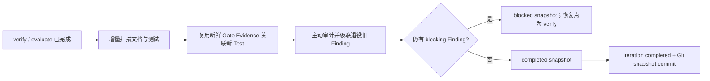

# Universal Harness 运行恢复与证据闭环设计

日期：2026-08-15  
状态：待用户书面审阅  
适用范围：Universal Harness Runtime、Graph、CLI；Atlas MVP 作为首个迁移验证项目

## 1. 背景

Atlas MVP 的 T5 Walking Skeleton 首次通过真实 dsh Agent 完成了需求录入、影响分析、计划、执行、项目门禁、评估与快照。源码、Maven、Pytest 和双进程 smoke 均通过，但完成后的 `harness status` 仍显示：

- 首次 dsh 凭证失败留下的任务 blocker 未在成功重试后退役；
- 完成快照阶段新扫描出的 7 个测试节点没有关联已经通过的项目门禁 Evidence；
- 首次失败 Run 没有 EvaluationCase，覆盖率为 16/17；
- 迭代已经标记 `completed`，后置审计却可以再产生 blocking Finding。

这不是 Atlas 业务代码问题，而是 Harness 在恢复、绑定、评估和完成顺序上的通用语义缺口。本设计采用图谱原生方案修复，不通过隐藏 Finding、删除失败历史或手工修改 Atlas 账本来制造绿色状态。

## 2. 目标与非目标

### 2.1 目标

1. 成功重试后，已恢复任务不再被旧运行 blocker 阻塞。
2. 每个终态 Run，包括失败、阻断和成功 Run，都有最终 EvaluationCase 与显式 `EVALUATES` 关系。
3. EvaluationCase 的生命周期状态与运行是否通过解耦：最终失败判定也可以是 `accepted` 的最终判定，`passed` 单独记录。
4. Gate 产生的忽略目录或构建产物不得污染代码绑定摘要；未忽略的新源码必须改变摘要。
5. 完成阶段扫描出的 Test 节点可以复用绑定仍然新鲜的全量 Gate Evidence，不产生一轮延迟的 `missing_verification`。
6. blocking audit Finding 必须阻止完成快照；`completed` 必须意味着当前权威图没有阻断项。
7. 提供一个追加式、幂等的维护入口，修复已有项目的历史缺口，不重写或删除旧账本。
8. Atlas 迁移完成后的验收结果为：`blockers=[]`、无 stale evidence、评估覆盖率全量、图缓存与账本完整性通过。

### 2.2 非目标

- 不删除或改写失败 Run、旧 checkpoint、旧 Finding 和旧快照。
- 不把失败 Run 从覆盖率分母中排除。
- 不把 blocking Finding 降级成 warning 来绕过完成条件。
- 不在维护命令中重新调用 Coding Agent 或自动修改项目源码。
- 不复用绑定已经漂移的 Gate Evidence。
- 不改变 Atlas T5 的业务实现和已通过的测试口径。

## 3. 核心不变量

### 3.1 账本与图

- `.harness/ledger` 继续是唯一权威来源，SQLite 只是可重建缓存。
- 所有修复均以新节点修订、新边状态或新操作追加，不覆盖历史文件。
- 一个终态 Run 必须满足：
  - `Run EXECUTES Task`；
  - `Run PRODUCES Evidence`；
  - `Evidence SUPPORTS EvaluationCase`；
  - `EvaluationCase EVALUATES Run`；
  - `EvaluationCase EVALUATES Task`。

### 3.2 判定状态

- `EvaluationCase.status=accepted` 表示“这是非 provisional 的最终判定”，不表示运行成功。
- 成败记录在 `extensions["harness.evaluation"].passed` 和维度结果中。
- provisional 判定保持 `proposed`，不得计入最终覆盖率。
- 评估覆盖率统计所有终态 Run；失败历史不可通过过滤分母消失。

### 3.3 完成状态

- `Iteration.status=completed`、completed Snapshot 和完成 checkpoint 只能在以下条件全部满足后提交：
  - required Task 已完成；
  - mandatory Gate Evidence 当前有效；
  - required Run 已有最终评估；
  - 完成阶段增量扫描已落账；
  - 新 Test 已完成 Evidence 关联；
  - 主动审计不存在 blocking Finding。

## 4. 方案

### 4.1 Git-aware 代码绑定摘要

`hashWorktreeCode` 不再递归读取几乎整个工作区，而是从 Git 获取代码候选集合：

```text
git ls-files --cached --others --exclude-standard -z
```

规则如下：

- 包含 tracked 文件和未被 `.gitignore` 排除的 untracked 文件；
- 排除 `.git/`、`.harness/` 和控制面保留路径；
- 每项绑定相对路径、Git mode 或文件类型、内容摘要；
- 对符号链接绑定链接目标，不跟随到仓库外；
- 使用 NUL 分隔解析，正确处理空格和非 ASCII 路径；
- 排序后生成最终摘要。

因此，`target/`、`.venv/`、缓存和测试报告等已忽略输出不会让同一 Gate verdict 在运行后立即变旧；新增但未提交的真实源码仍会改变摘要。如果 Git 查询失败，Harness 返回 typed configuration failure，不回退到可能包含秘密或巨大依赖目录的递归扫描。

### 4.2 终态 Run 即时评估

执行器返回后，Runtime 先终止 Run，再根据结果进入唯一一次评估，之后才决定继续或阻塞：

1. 提交 Run result；
2. 成功 Run 继续进入 verify，并由既有 `phaseEvaluate` 调用 Evaluation Port；
3. 无法进入后续 phase 的失败 Run 在阻塞前立即调用 Evaluation Port；
4. 两条路径都通过同一个幂等 `evaluateAndCommitRun` 提交评估报告、Finding 和完整 Run–Evidence–EvaluationCase–Task 图链；
5. 失败 Run 完成评估后仍按现有失败分类阻塞，不会继续执行 Gate 或把 Task 标成完成。

失败 Run 的 EvaluationCase 是最终判定，因此非 provisional 时状态为 `accepted`，但 `passed=false`。评估可以把凭证缺失等 typed failure 判为正确失败，同时保留 outcome/safety/trajectory/efficiency/correct-failure 五维记录；它不会把失败任务标记为完成。

同一 Run 只能产生一个绑定其 Run result digest 与评估策略 digest 的最终评估；resume 先查账本绑定，命中时复用，避免重复调用评估端口。

### 4.3 恢复后的 blocker 退役

blocker 由产生它的 Phase 拥有。执行阶段成功完成某个 Task 后，checkpoint 的 `clear_blockers` 精确清除该 Task 以前的：

```text
task <task-id> did not complete: ...
```

不清除审批、其他 Task、Gate、审计或人工 blocker。

为兼容已经完成的历史工作流，状态投影同时采用当前事实判定活性：如果同一迭代中的 Task 已是 `accepted`，旧 task-failure blocker 只作为历史 checkpoint 内容保留，不再是 live blocker。这不是隐藏失败；失败 Run、失败 Evidence 和 EvaluationCase 仍在图中可查询。

### 4.4 完成阶段重新排序

完成相位调整为：



如果审计发现 blocking Finding，Runtime 不得先写 completed Snapshot 或 completed Iteration。恢复点选择 `verify`：源码修复会产生新绑定并重跑 Gate；纯图修复可以复用绑定仍然匹配的 verdict。warning 不阻止完成。

### 4.5 Test 与 Gate Evidence 的关联

增量扫描落账后，Runtime 使用稳定代码绑定查找本迭代的 verify artifact 和 Evidence：

- Test 的 verification 显式命名 Gate 时，只接受该 Gate；
- 未命名具体 Gate 的 Test 由 mandatory suite Evidence 共同背书；
- 项目 Gate 可通过其 `subject_id` 和 stack/language 元数据缩小关联范围；M1 兼容配置在无范围声明时仍表示“全量项目门禁”；
- Evidence 绑定不匹配当前代码摘要时禁止补边，并产生可恢复 blocker；
- 补边完成后再运行审计，同一次完成尝试内不得出现一轮延迟。

### 4.6 历史项目维护命令

新增：

```text
harness graph reconcile
```

命令在一个追加式 ledger operation 中执行：

1. 为缺少 `EXECUTES` 的历史 Run 恢复 Task 关系；
2. 为没有最终评估的终态 Run 生成确定性运行结果 EvaluationCase；
3. 对绑定仍匹配的历史 Gate Evidence 补齐 Test 关联；
4. 重跑主动审计，supersede 已消失的 Finding，并退役其活动 `BLOCKS` 边；
5. 重建 SQLite 缓存并输出变更计数。

命令必须幂等：第二次执行新增节点、边和修订数均为 0。遇到无法确定 Task、缺失 Run result、provisional Evidence 或绑定漂移时不猜测，返回逐项 `skipped` 和非零状态。它不会运行 Agent，也不会自动接受人工审批。

现有 `graph backfill-evaluations` 保持兼容，并在文档中标记为 `graph reconcile` 的评估子集；后续可内部委托同一服务。

## 5. 错误处理

- Git 文件枚举失败：`configuration`，不执行 Gate。
- terminal Run 无 Task 归属：维护命令记录 skipped，不创建猜测边。
- Evidence 绑定漂移：不复用，状态提示重新运行 verify。
- 评估端口失败：保留 Run result，工作流以 evaluation failure 阻塞，可恢复且不重复 Run side effect。
- 审计产生 blocker：写 blocked Snapshot，不写 completed Iteration。
- 维护过程中断：依赖现有 LedgerRepository 原子提交和重放恢复，不产生半个权威操作。

## 6. 测试设计

### 6.1 单元测试

- 代码摘要在 ignored `target/`、`.venv/`、日志变化后保持一致。
- tracked 或未忽略源码变化会改变摘要。
- 符号链接只绑定链接目标，不读取仓库外内容。
- 最终失败 EvaluationCase 为 `accepted` 且 `passed=false`。
- provisional EvaluationCase 不进入覆盖率。
- 状态只退役已经恢复的 task-failure blocker。

### 6.2 编排集成测试

- 第一次 Agent typed failure、第二次成功：两个 Run 都有 EvaluationCase，Task 最终 accepted，live blocker 为空，覆盖率 2/2。
- Gate 创建 ignored 构建输出后新增 Test：完成阶段能复用 Evidence 并在审计前补边。
- 新 Test 没有新鲜 Evidence：迭代停在 blocked，不会产生 completed Snapshot。
- 审计发现 task orphan 或 missing verification：completed 状态不可达。
- 重复 resume 不重复评估、Evidence、边或外部副作用。

### 6.3 CLI 与迁移测试

- `graph reconcile` 修复包含失败重试和新 Test 的历史 fixture。
- 第二次 reconcile 是严格 no-op。
- 绑定漂移与缺失映射返回结构化 skipped，且不写猜测记录。
- Atlas 验收：`graph check` 通过、blocker 为 0、17/17 Run 评估覆盖、任务投影无漂移。

## 7. 实施边界与提交顺序

1. 先以失败测试固定 Git-aware 绑定摘要。
2. 再固定终态 Run 评估与 EvaluationCase 状态语义。
3. 修复 checkpoint blocker ownership 和状态投影兼容逻辑。
4. 调整完成相位顺序，保证审计是 completed 的前置门禁。
5. 抽取 reconcile runtime service，并接入 CLI。
6. 全量验证 Universal Harness。
7. 在 Atlas 运行 `graph reconcile`，验证 0 blocker、17/17、幂等和 smoke。
8. 提交并推送 Universal `main` 与 Atlas `codex/harness-driven-t5`。

## 8. 验收标准

- Universal Harness 全量测试、lint、构建、类型检查与 standalone 扫描通过。
- typed failure → 配置修复 → resume → Gate → Evaluation → Audit → completed Snapshot 形成单一可追溯纵向闭环。
- 每个终态 Run 都能沿图追溯到 Task、Evidence 和最终 EvaluationCase。
- ignored Gate 输出不导致 Evidence 自我失效。
- blocking audit Finding 与 completed Iteration 不再同时成立。
- Atlas T5 业务门禁和双进程 smoke 保持绿色。
- Atlas 最终 `harness status` 无 blocker，评估覆盖率为 17/17，`graph reconcile` 第二次运行无新增记录。
